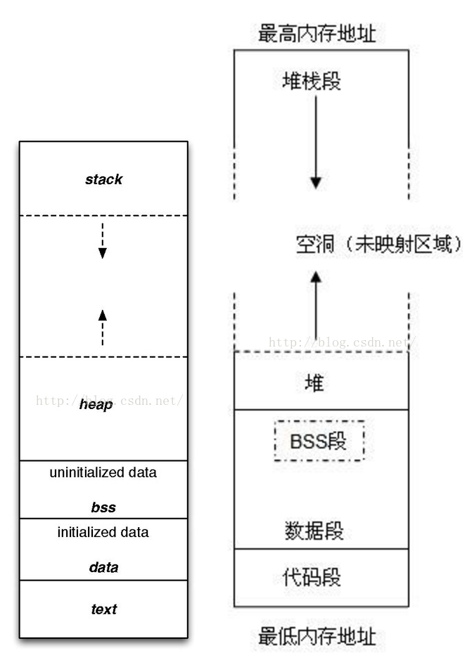
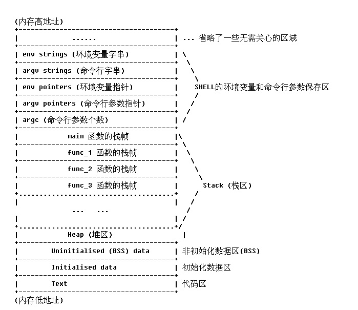
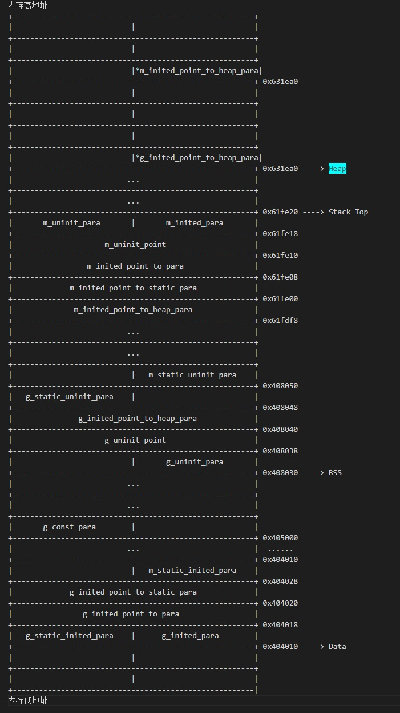

# C/C++程序内存结构

*使用图例和代码示例来简析C/C++程序内存结构*

## 目录
+ [基本概念](#基本概念)
    + [内存分配](#内存分配)
    + [Code BSS Data（代码段、BSS数据段、数据段）](#code-bss-data)
    + [Heap Stack（堆、栈）](#heap-stack)
+ [图解](#图解)
+ [代码示例](#代码示例)

## 基本概念

### 内存分配

*程序被加载到内存中，这块内存会有两种属性*

静态分配内存：程序 **编译链接时** 确定的内存。
动态分配内存：程序 **加载、调入和执行时** 分配/回收的内存。

下文中的 Text & BSS & Data 就是静态分配的内存，在程序一开始就确定了大小，而 Heap & Stack 就是在程序运行时所分配的动态分配内存。

### Code BSS Data

+ #### Code（代码段）
    Code（代码段），也被叫做Text（文本段），通常指 **存放程序执行代码** 的一块内存区域。这块内存区域的大小在程序运行前就已经确定，并且这块内存区域 是只读的，只在某些架构被运行更改。在代码段中还存在某些只读的常数变量，例如字符串常量等。

+ #### BSS（BSS数据段）
    BSS段，Block Started by Symbol的简称，通常指 **存放程序未初始化的全局变量** 的一块内存区域。BSS段属于静态分配内存。
    ~~*BSS段可看做特殊的Data数据段，存储没有初始化的全局变量*~~

+ #### Data（数据段）
    Data数据段通常指 **存放程序已初始化的全局变量** 的一块内存区域。Data段属于静态分配内存。

### Heap Stack（堆、栈）

+ ### Heap堆
    Heap堆，在内存分配中通常指 **存放进行运行中动态 分配/释放** 的内存区域。当程序使用 malloc/new 等函数分配内存时，分配的内存就被动态的添加到了Heap堆上；当程序使用 free/delete 等函数释放内存时，被释放的内存就被Heap堆给删除掉了。
    *tips：Heap堆和数据结构中的堆不是同一个东西，Heap堆的分配类似于链表*

+ ### Stack栈
    Stack栈，在内存分配中通常指 **存放程序临时创建的局部变量** 的内存区域，也就是存放代码中{...}内的变量（static声明的局部变量被存放于数据段，不被放在Stack栈中）。
    此外，函数被调用时，其参数会被压入栈中，等到函数调用结束，其返回值也会被压入栈中。
    *tips：因为栈先进后出的特点，所以栈特别容易用来保存/恢复调用的上下文，调用栈就是这么来*


## 图解

进程的虚拟地址空间如下：

[图源自网络]

[图源自网络]

+ 随着函数调用层数的增加，函数栈会一块一块的向低地址方向延伸；
+ 随着进程中的函数调用层数减少（调用返回），函数栈会一块块的遗弃，向高地址方向回缩；
    *tips：跟数据结构中，先进后出的栈一样*
+ 各个函数的栈的大小因函数的不同而不一致，具体大小由函数内的局部变量的大小和数目决定；
+ Text代码段是个只读区域，存放程序的二进制代码，并且被多个运行该可执行文件的所共享。任何尝试对该区域的写操作都会导致段违法出错。
+ 进程对内存的动态申请发生在Heap堆里。随着系统动态分配给进程的内存数量的增加，Heap堆一般来说是向内存的高地址方向增长。
    *tips：重申一下，Heap堆和数据结构的堆不一样，其内部实现方式更像链表*
+ BSS段或者Stack栈的增长耗尽了系统分配给进程的自由内存的情况下，进程将会被阻塞, 重新被操作系统用更大的内存模块来调度运行。
+ 函数栈的数据包含了主调函数的下一条执行指令的地址。

## 代码示例

C/C++示例代码如下：
```c++
#include <stdio.h>
#include <stdlib.h>
#include <iostream>
using namespace std;

int g_uninit_para;
int g_inited_para = 1;

static int g_static_uninit_para;
static int g_static_inited_para = 2;

const int g_const_para = 3;

int* g_uninit_point;
int* g_inited_point_to_para = &g_inited_para;
int* g_inited_point_to_static_para = &g_static_inited_para;

int* g_inited_point_to_heap_para = new int(4);

int main(void)
{
	int m_uninit_para;
	int m_inited_para = 5;

	static int m_static_uninit_para;
	static int m_static_inited_para = 5;

	int* m_uninit_point;
    int* m_inited_point_to_para = &m_inited_para;
	int* m_inited_point_to_static_para = &m_static_inited_para;

	int* m_inited_point_to_heap_para = new int(6);

	cout << "=======================global=======================" << endl;

	cout << "g_uninit_para = " << g_uninit_para << " " << "&g_uninit_para = " << &g_uninit_para << endl;
	cout << "g_inited_para = " << g_inited_para << " " << "&g_inited_para = " << &g_inited_para << endl;

	cout << "g_static_uninit_para = " << g_static_uninit_para << " " << "&g_static_uninit_para = " << &g_static_uninit_para << endl;
	cout << "g_static_inited_para = " << g_static_inited_para << " " << "&g_static_inited_para = " << &g_static_inited_para << endl;

	cout << "g_const_para = " << g_const_para << " " << "&g_const_para = " << &g_const_para << endl;
	
	cout << "g_uninit_point = " << g_uninit_point << " " << "*g_uninit_point = " << "nullptr" << " " << "&g_uninit_point = " << &g_uninit_point << endl;
    cout << "g_inited_point_to_para = " << g_inited_point_to_para << " " << "*g_inited_point_to_para = " << *g_inited_point_to_para << " " << "&g_inited_point_to_para = " << &g_inited_point_to_para << endl;
	cout << "g_inited_point_to_static_para = " << g_inited_point_to_static_para << " " << "*g_inited_point_to_static_para = " << *g_inited_point_to_static_para << " " << "&g_inited_point_to_static_para = " << &g_inited_point_to_static_para << endl;

	cout << "g_inited_point_to_heap_para = " << g_inited_point_to_heap_para << " " << "*g_inited_point_to_heap_para = " << *g_inited_point_to_heap_para << " " << "&g_inited_point_to_heap_para = " << &g_inited_point_to_heap_para << endl;

	
	cout << "=======================global=======================" << endl;

	cout << "m_uninit_para = " << m_uninit_para << " " << "&m_uninit_para = " << &m_uninit_para << endl;
	cout << "m_inited_para = " << m_inited_para << " " << "&m_inited_para = " << &m_inited_para << endl;

	cout << "m_static_uninit_para = " << m_static_uninit_para << " " << "&m_static_uninit_para = " << &m_static_uninit_para << endl;
	cout << "m_static_inited_para = " << m_static_inited_para << " " << "&m_static_inited_para = " << &m_static_inited_para << endl;
	
	cout << "m_uninit_point = " << m_uninit_point << " " << "*m_uninit_point = " << "nullptr" << " " << "&m_uninit_point = " << &m_uninit_point << endl;
    cout << "m_inited_point_to_para = " << m_inited_point_to_para << " " << "*m_inited_point_to_para = " << *m_inited_point_to_para << " " << "&m_inited_point_to_para = " << &m_inited_point_to_para << endl;
	cout << "m_inited_point_to_static_para = " << m_inited_point_to_static_para << " " << "*m_inited_point_to_static_para = " << *m_inited_point_to_static_para << " " << "&m_inited_point_to_static_para = " << &m_inited_point_to_static_para << endl;

	cout << "m_inited_point_to_heap_para = " << m_inited_point_to_heap_para << " " << "*m_inited_point_to_heap_para = " << *m_inited_point_to_heap_para << " " << "&m_inited_point_to_heap_para = " << &m_inited_point_to_heap_para << endl;
 

    delete m_inited_point_to_heap_para;
    delete g_inited_point_to_heap_para;
 	return 0;
}
```
运行之后可以得到如下结果：
```
=======================global=======================
g_uninit_para = 0 &g_uninit_para = 0x408030
g_inited_para = 1 &g_inited_para = 0x404010
g_static_uninit_para = 0 &g_static_uninit_para = 0x40804c
g_static_inited_para = 2 &g_static_inited_para = 0x404014
g_const_para = 3 &g_const_para = 0x405004
g_uninit_point = 0 *g_uninit_point = nullptr &g_uninit_point = 0x408038
g_inited_point_to_para = 0x404010 *g_inited_point_to_para = 1 &g_inited_point_to_para = 0x404018
g_inited_point_to_static_para = 0x404014 *g_inited_point_to_static_para = 2 &g_inited_point_to_static_para = 0x404020
g_inited_point_to_heap_para = 0x631ea0 *g_inited_point_to_heap_para = 4 &g_inited_point_to_heap_para = 0x408040
=======================global=======================
m_uninit_para = 0 &m_uninit_para = 0x61fe1c
m_inited_para = 5 &m_inited_para = 0x61fe18
m_static_uninit_para = 0 &m_static_uninit_para = 0x408050
m_static_inited_para = 5 &m_static_inited_para = 0x404028
m_uninit_point = 0x7716f0 *m_uninit_point = nullptr &m_uninit_point = 0x61fe10
m_inited_point_to_para = 0x61fe18 *m_inited_point_to_para = 5 &m_inited_point_to_para = 0x61fe08
m_inited_point_to_static_para = 0x404028 *m_inited_point_to_static_para = 5 &m_inited_point_to_static_para = 0x61fe00
m_inited_point_to_heap_para = 0x631ec0 *m_inited_point_to_heap_para = 6 &m_inited_point_to_heap_para = 0x61fdf8
```
让我们来分析一下得到的结果：
___
***BSS = 0x408030 Data = 0x404010 Heap = 0x631ea0 Stack = 0x61fe1c***
g_uninit_para = 0 &g_uninit_para = **BSS**
g_inited_para = 1 &g_inited_para = **Data**
g_static_uninit_para = 0 &g_static_uninit_para = **BSS + 0x1c**
g_static_inited_para = 2 &g_static_inited_para = **Data + 0x4**
g_const_para = 3 &g_const_para = **Data + 0x994**
g_uninit_point = 0 *g_uninit_point = nullptr &g_uninit_point = **BSS + 0x8**
g_inited_point_to_para = **Data** *g_inited_point_to_para = 1 &g_inited_point_to_para = **Data + 0x8**
g_inited_point_to_static_para = **Data + 0x4** *g_inited_point_to_static_para = 2 &g_inited_point_to_static_para = **Data + 0x10**
g_inited_point_to_heap_para = **Heap** *g_inited_point_to_heap_para = 4 &g_inited_point_to_heap_para = **BSS + 0x10**
___
m_uninit_para = 0 &m_uninit_para = **Stack**
m_inited_para = 5 &m_inited_para = **Stack - 0x4**
m_static_uninit_para = 0 &m_static_uninit_para = **BSS + 0x20**
m_static_inited_para = 5 &m_static_inited_para = **Data + 0x18**
m_uninit_point = 0x7716f0 *m_uninit_point = nullptr &m_uninit_point = **Stack - 0xc**
m_inited_point_to_para = **Stack - 0x4** *m_inited_point_to_para = 5 &m_inited_point_to_para = **Stack - 0x14**
m_inited_point_to_static_para = **Data + 0x18** *m_inited_point_to_static_para = 5 &m_inited_point_to_static_para = **Stack - 0x1c**
m_inited_point_to_heap_para = **Heap + 0x20** *m_inited_point_to_heap_para = 6 &m_inited_point_to_heap_para = **Stack - 0x24**
___
根据内存地址画出映射图：



+ 能得到验证的部分：
	+ **全局/静态的已初始化的变量** 存放在Data数据段；
	+ 数据段往上的部分就是BSS，存放 **全局/静态的未初始化的变量**；
	*tips：所以有BSS是Data数据段一部分的说法，Data和BSS在地址上比较接近*
	+ Stack栈在比较高的内存地址上，存放 **局部变量** ，并且Stack栈的增长是从高地址往低地址进行的；
	+ Heap堆存放 **new/malloc 动态创建的内存**，并且Heap堆的增长是从低地址到高地址进行的。
+ 比较特殊的现象：
	+ **g_inited_point_to_heap_para** 全局的指向heap的指针被放到了BSS段里，这里难道是把这类指针当做了未初始化的全局变量；
	+ Heap堆不像前文图解中预想的那样，分布在BSS段和Stack栈之间，而是被放到了Stack栈顶的上面，往更高地址进行扩展；
	+ **g_static_uninit_para** 没有紧挨着 **g_uninit_para**，**g_static_inited_para** 却是紧挨着 **g_inited_para**；
	+ 可推导出不严谨的规律，Data段中已初始化的全局/静态变量的声明顺序与内存地址一致，BSS中未初始化的全局/静态变量的声明顺序与内存地址不完全一致。

让我们尝试修改原代码，多动态创建几组不同的指针：
```c++
......

int* g_inited_point_to_heap_para0 = new int(4);
int* g_inited_point_to_heap_para1 = new int(5);
int* g_inited_point_to_heap_para2 = new int(6);
int* g_inited_point_to_heap_para3 = new int(7);

......

int main(void)
{
	......

	int* m_inited_point_to_heap_para0 = new int(11);
	int* m_inited_point_to_heap_para1 = new int(12);
	int* m_inited_point_to_heap_para2 = new int(13);
	int* m_inited_point_to_heap_para3 = new int(14);

	cout << "=======================global=======================" << endl;

	......

	cout << "g_inited_point_to_heap_para0 = " << g_inited_point_to_heap_para0 << " " << "*g_inited_point_to_heap_para0 = " << *g_inited_point_to_heap_para0 << " " << "&g_inited_point_to_heap_para0 = " << &g_inited_point_to_heap_para0 << endl;
	cout << "g_inited_point_to_heap_para1 = " << g_inited_point_to_heap_para1 << " " << "*g_inited_point_to_heap_para1 = " << *g_inited_point_to_heap_para1 << " " << "&g_inited_point_to_heap_para1 = " << &g_inited_point_to_heap_para1 << endl;
	cout << "g_inited_point_to_heap_para2 = " << g_inited_point_to_heap_para2 << " " << "*g_inited_point_to_heap_para2 = " << *g_inited_point_to_heap_para2 << " " << "&g_inited_point_to_heap_para2 = " << &g_inited_point_to_heap_para2 << endl;
	cout << "g_inited_point_to_heap_para3 = " << g_inited_point_to_heap_para3 << " " << "*g_inited_point_to_heap_para3 = " << *g_inited_point_to_heap_para3 << " " << "&g_inited_point_to_heap_para3 = " << &g_inited_point_to_heap_para3 << endl;
	
	cout << "=======================global=======================" << endl;

	......

	cout << "m_inited_point_to_heap_para0 = " << m_inited_point_to_heap_para0 << " " << "*m_inited_point_to_heap_para0 = " << *m_inited_point_to_heap_para0 << " " << "&m_inited_point_to_heap_para0 = " << &m_inited_point_to_heap_para0 << endl;
	cout << "m_inited_point_to_heap_para1 = " << m_inited_point_to_heap_para1 << " " << "*m_inited_point_to_heap_para1 = " << *m_inited_point_to_heap_para1 << " " << "&m_inited_point_to_heap_para1 = " << &m_inited_point_to_heap_para1 << endl;
	cout << "m_inited_point_to_heap_para2 = " << m_inited_point_to_heap_para2 << " " << "*m_inited_point_to_heap_para2 = " << *m_inited_point_to_heap_para2 << " " << "&m_inited_point_to_heap_para2 = " << &m_inited_point_to_heap_para2 << endl;
	cout << "m_inited_point_to_heap_para3 = " << m_inited_point_to_heap_para3 << " " << "*m_inited_point_to_heap_para3 = " << *m_inited_point_to_heap_para3 << " " << "&m_inited_point_to_heap_para3 = " << &m_inited_point_to_heap_para3 << endl;
 
 	return 0;
}
```

运行之后可得到如下结果：
```
=======================global=======================
g_uninit_para = 0 &g_uninit_para = 0x408040
g_inited_para = 1 &g_inited_para = 0x404010
g_static_uninit_para = 0 &g_static_uninit_para = 0x408074
g_static_inited_para = 2 &g_static_inited_para = 0x404014
g_const_para = 3 &g_const_para = 0x405004
g_const_point_to_chars = abcdefg &g_const_point_to_chars = 0x404018    
g_const_string = hijklmn &g_const_string = 0x408080
g_uninit_point = 0 *g_uninit_point = nullptr &g_uninit_point = 0x408048
g_inited_point_to_para = 0x404010 *g_inited_point_to_para = 1 &g_inited_point_to_para = 0x404020
g_inited_point_to_static_para = 0x404014 *g_inited_point_to_static_para = 2 &g_inited_point_to_static_para = 0x404028
g_inited_point_to_heap_para0 = 0xec1770 *g_inited_point_to_heap_para0 = 4 &g_inited_point_to_heap_para0 = 0x408050   
g_inited_point_to_heap_para1 = 0x24f1e60 *g_inited_point_to_heap_para1 = 5 &g_inited_point_to_heap_para1 = 0x408058  
g_inited_point_to_heap_para2 = 0x24f1e80 *g_inited_point_to_heap_para2 = 6 &g_inited_point_to_heap_para2 = 0x408060  
g_inited_point_to_heap_para3 = 0x24f1ea0 *g_inited_point_to_heap_para3 = 7 &g_inited_point_to_heap_para3 = 0x408068  
=======================global=======================
m_uninit_para = 0 &m_uninit_para = 0x61fd30
m_inited_para = 8 &m_inited_para = 0x61fd2c
m_static_uninit_para = 0 &m_static_uninit_para = 0x4080a0
m_static_inited_para = 9 &m_static_inited_para = 0x404030
m_const_para = 10 &m_const_para = 0x61fd28
g_const_point_to_chars = abcdefg &g_const_point_to_chars = 0x404018
m_const_string = hijklmn &m_const_string = 0x61fd00
m_uninit_point = 0 *m_uninit_point = nullptr &m_uninit_point = 0x61fcf8
m_const_point_to_chars = abcdefg *m_const_point_to_chars = a &m_inited_point_to_para = 0x61fcf0
m_inited_point_to_static_para = 0x404030 *m_inited_point_to_static_para = 9 &m_inited_point_to_static_para = 0x61fce8
m_inited_point_to_heap_para0 = 0x24f1ec0 *m_inited_point_to_heap_para0 = 11 &m_inited_point_to_heap_para0 = 0x61fce0 
m_inited_point_to_heap_para1 = 0x24f1ee0 *m_inited_point_to_heap_para1 = 12 &m_inited_point_to_heap_para1 = 0x61fcd8 
m_inited_point_to_heap_para2 = 0x24f1f00 *m_inited_point_to_heap_para2 = 13 &m_inited_point_to_heap_para2 = 0x61fcd0 
m_inited_point_to_heap_para3 = 0x24f1f20 *m_inited_point_to_heap_para3 = 14 &m_inited_point_to_heap_para3 = 0x61fcc8 
```
+ 待我们申请的heap堆的空间的数目变多时，Heap堆的地址有一次重定位，从0xec1700变到了更高的0x24f1e60；
+ Heap堆内的地址划分并没有按照变量类型的长度或者2倍的长度去分配，就算申请`int`类型的变量，实际占得的内存大小为0x20。
