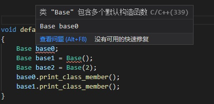
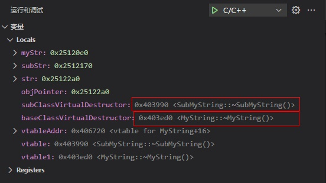
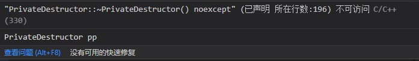
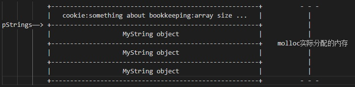
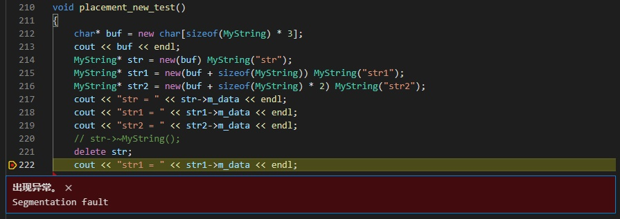

# 浅谈构造、析构以及 new/delete

*结合代码示例来讨论一下构造、析构以及内存分配、释放的相关问题*

## 目录
+ [构造与析构](#构造与析构)
    + [构造](#构造)
        + [默认构造](#默认构造)
        + [非默认构造](#非默认构造)
    + [拷贝中的构造与赋值](#拷贝中的构造与赋值)
        + [浅拷贝与深拷贝](#浅拷贝与深拷贝)
        + [拷贝构造](#拷贝构造)
        + [拷贝赋值](#拷贝赋值)
    + [析构](#析构)
        + [析构的作用与时机](#析构的作用与时机)
        + [虚析构](#虚析构)
        + [私有析构函数](#私有析构函数)
    + [构造与析构的顺序](#构造与析构的顺序)
+ [new/delete](#new/delete)

## 构造与析构

### 构造

#### 默认构造
思考一个问题，什么是默认构造函数？
是由编译器默认生成的构造函数？还是不带参数的构造函数？
都不对，准确的定义应该是： **调用时不需要显式的传入实参的构造函数** 被称为默认构造函数。
如下列代码所示的调用默认构造函数：
```c++
class Base
{
    ......
};
......
Base base0;
Base base1 = Base(); // Base() <---- create an anonymous-object with default constructor
......
```
我们能想到的对应的默认构造函数应该有：
+ 由 **编译器自动生成** 的构造函数
```c++
class Base
{
    int para;
    int* point;
    // Base(); <----compiler create default constructor
};
```
+ 由我们 **显式声明的不带参数** 的构造函数
```c++
class Base
{
    int para;
    int* point;
    // default constructor without parameter
    Base() {
        ......
    }
};
```
+ 由我们 **显式声明的、只带有默认参数** 的构造函数
```c++
class Base
{
    int para;
    int* point;
    // default constructor with only default parameters
    Base(int i = 1 /*int j = 1, int k = 1*/) {
        ......
    }
    // user's constructor with Non-default parameters and default parameters
    Base(int m, int i = 1 /*int j = 1, int k = 1*/) {
        ......
    }
};
```
默认参数的构造函数情况比较特殊，只有在我们实际调用的时候才能真正的确定它被当做默认构造函数还是非默认构造函数。

```c++
class Base
{
public:
    int para;
    int* point;
public:
    Base() { ...... }
    Base(int i = 1) { ...... }
};
```
下图为编译器的报错提示：



可见，省略调用参数的 **只带默认参数构造函数** 被当做了默认构造函数；使用传入参数的 **只带默认参数构造函数** 被识别成了非默认构造函数。
*tips：声明构造函数时，显式的声明默认构造函数，不让只有默认参数的构造函数和空默认构造函数，是一种好的代码习惯。*

#### 非默认构造
*传实参的构造，拷贝构造，移动构造都是非默认构造函数*
+ 传实参的构造

两种不同的写法：
```c++
// 初始化列表构造函数
class Base
{
    int para;
    int* point;
    // Initialization list constuctor
    Base(int para, int* point) : para(para), point(point) {};
};
```
```c++
// 多参数构造函数
class Base
{
    int para;
    int* point;
    // parameters constuctor
    Base(int i, int* point) {
        para = i;
        point = point;
    }
};
```

+ [拷贝构造](#拷贝构造)

+ 移动构造[点击跳转链接]

### 拷贝中的构造与赋值

#### 浅拷贝与深拷贝
让我们先看一段代码，来了解一下拷贝的细节：
```c++
class MyString
{
public:
    uint32_t m_size;
    char* m_data;

    void print_class_member() {
        cout << "MyString info: m_size = " << m_size << " " << "m_data = " << m_data << endl;
    }

    MyString(const char* cstr = nullptr, const uint32_t size = 1) {
        if (cstr != nullptr) {
            m_size = strlen(cstr);
            m_data = new char[m_size + 1];
            strcpy(m_data, cstr);
        }
        else {
            m_size = 0;
            m_data = new char[m_size + 1];
            m_data[0] = '\0';
        }
    }
    ~MyString() { delete[] m_data; }
};
......
    MyString str0("abcd");
    MyString str1 = str0;
    str0.m_data[0] = 'f';
    MyString str2;
    str2 = str0;
    str0.m_data[0] = 'e';
```
我们构建了一个 `str0`，包含值表示大小的 `int` 类型的变量和字符数组的指针，然后我们想复制出来一个与 `str0` 一样的对象 `str1`；
然后我们把 `str0` 的字符数组改为fbcd，并以此为基础复制出来 `str2`；
最后再把 `str1` 的变量数值改为ebcd。
让我们看一下运行结果：
```
MyString info: m_size = 4 m_data = ebcd m_data addr = 0x631e80   
MyString info: m_size = 4 m_data = ebcd m_data addr = 0x631e80   
MyString info: m_size = 4 m_data = ebcd m_data addr = 0x631e80  
```
与预想的 `str1.m_data` 的值为 `"abcd"` 和 `str2.m_data` 的值为 `"fbcd"` 的结果不一样，`str0.m_data`、`str1.m_data`、`str2.m_data` 三个的值都是 `"ebcd"`，而且指针都指向 `0x631e80`。这种情况就是浅拷贝造成。
在对象复制时，只对对象的数据成员进行 **简单的赋值**，这就叫做浅拷贝；
与此相对的，对对象的数据成员 **重新进行空间分配** ，被称为深拷贝。
一般情况下，浅拷贝可以很好的应对对象的复制操作；但是一旦遇到动态成员（指针等），就需要使用深拷贝来重新动态的分配空间了。
前面代码中的 `MyString str1 = str0;` 和 `str2 = str0;` 两种拷贝行为被分别称为拷贝构造和拷贝赋值，接下来让我们深入了解一下这两种拷贝的具体细节。

#### 拷贝构造
`MyString str1 = str0;` 为什么会被叫做拷贝构造呢？
因为这行代码本质上是对 `str1` 做了一次构造，等同于 `Base str1(str0);` ，即用同一个类型的对象来构造出一个新的对象。
在没有自定义拷贝构造函数的情况下，编译器会为我们生成一个默认拷贝构造函数，只拥有浅拷贝能力。
让我们来定义一下深拷贝的拷贝构造函数：
```c++
inline MyString::MyString(const MyString& str) {
    m_size = str.m_size;
    m_data = new char[m_size + 1];
    strcpy(m_data, str.m_data);
}
```
这样使用深拷贝， `str1.m_data` 指向重新开辟的一块内存空间，并把数据拷贝过去，得到我们想要的的复制出来的新的str1。
*tips：拷贝构造内的 `str.m_data` 就算是 `private` 类型的成员也是可以这样直接访问的，因为兄弟对象之间互为友缘 `friend`*

#### 拷贝赋值
`str2 = str0;` 被称为拷贝赋值，从本质上讲就是一种赋值行为。
同样的，在我们没有自定义拷贝赋值函数之前，编译器给我们默认生成了一个只会浅拷贝的拷贝赋值函数。
我们也定义一下深拷贝的拷贝赋值函数：
```c++
inline MyString& MyString::operator=(const MyString& str) {
    if (this == &str) {
        return *this;
    }
    delete[] m_data;
    m_size = str.m_size;
    m_data = new char[m_size + 1];
    strcpy(m_data, str.m_data);
    return *this;
}
```
重载操作符 `=` 后，在遇到赋值操作时，就会调用到这个操作符函数中来，达到我们深拷贝的目的。
*tips：这个函数由好几个注意点，值得稍微看一看*
*1、为什么要做 `if (this == &str)` 判断？———判断当前赋值是不是自赋值，如果是 `str0 = str0` 这样的自赋值，后面不能进行内存释放*
*2、为什么要释放内存？———在赋值之前，肯定意见调用过构造函数了，赋值前需要做好内存管理*
*3、`MyString& MyString::operator=(const MyString& str)` 为什么要返回引用？——减少一次返回值的构造和析构，直接将 `*this` 的引用返回赋值到等号左边，而不去创建一个临时变量（后面展开，此处不做详细讨论）*

#### 拷贝的结果
最后让我们看一下拷贝构造和拷贝赋值的结果：
```c++
class MyString
{
public:
    uint32_t m_size;
    char* m_data;
    MyString(const char* cstr = nullptr, const uint32_t size = 1);
    MyString(const MyString& str);
    MyString::operator=(const MyString& str);
    ~MyString() {}
};
......
    MyString str0("abcd");
    MyString str1 = str0;
    str0.m_data[0] = 'f';
    MyString str2;
    str2 = str0;
    str0.m_data[0] = 'e';
```
```
MyString info: m_size = 4 m_data = ebcd m_data addr = 0xd41e80
MyString info: m_size = 4 m_data = abcd m_data addr = 0xd41ea0
MyString info: m_size = 4 m_data = fbcd m_data addr = 0xd41ec0
```
这样我们就能得到正确的拷贝结果。

### 析构
构造函数可能有很多个，但是析构函数就只有一个，就像饭桌上的食物，烹饪成菜的方式各种各样，但最终都会被我们咀嚼下肚。

#### 析构的作用与时机
一个类至多只能有一个析构函数，它不返回任何值，没有函数类型，没有函数参数，不能被重载。
让我们用一个小栗子，来看一下析构的作用：
```c++
class MyString
{
public:
    uint32_t m_size;
    char* m_data;
    MyString(const char* cstr = nullptr, const uint32_t size = 1);
    MyString(const MyString& str);
    MyString operator=(const MyString& str);
    ~MyString() {
        cout << m_data << " destuctor is invoked" << endl;
        // delete[] m_data;
    }
};
......
char* destructor_test()
{
    MyString str0("str0");
    return str0.m_data;
}

int main(void)
{
    char* data = destructor_test();
    cout << "str0.m_data addr = " << (void*)data << endl;
    MyString str1("str1");
    cout << "str1.m_data addr = " << (void*)str1.m_data << endl;
	return 0;
}
```
选择注释或者不注释 `delete[] m_data`，运行得到以下两种结果：
```
-----------不注释 delete[] m_data-----------
str0 destuctor is invoked
str0.m_data addr = 0x701e80
str1.m_data addr = 0x701e80 // str0.m_data被释放点的空间，再次被分配
str1 destuctor is invoked

-----------注释 delete[] m_data-----------
str0 destuctor is invoked
str0.m_data addr = 0x2511e80
str1.m_data addr = 0x2511ea0 // str0.m_data没有被释放掉，内存泄漏
str1 destuctor is invoked
```
这样我们对析构的作用就有了清晰的认识：
+ 在析构函数中管理我们动态申请的内存，在对象销毁调用析构函数时释放掉动态内存；
+ 不在析构函数中释放申请的内存，当类对象生命周期结束后，申请的内存仍然存在，不能被其他申请给使用。
*tips：这种情况就被叫做——内存泄漏*

让我们总结一下析构函数调用的时机：
```c++
class MyString
{
public:
    uint32_t m_size;
    char* m_data;
    MyString(const char* cstr = nullptr, const uint32_t size = 1);
    MyString(const MyString& str);
    MyString operator=(const MyString& str);
    ~MyString() {
        cout << m_data << " destuctor is invoked" << endl;
        // delete[] m_data;
    }
};
......
MyString g_str("global str");
MyString g_static_str("global static str");
MyString* g_point_to_str = new MyString("global point to heap str");
void destructor_test()
{
    cout << "----------func start----------" << endl;
    MyString m_local_str("local str");
    cout << "----------func start----------" << endl;
}
int main(void)
{
    cout << "----------main start----------" << endl;
    destructor_test();
    static MyString m_static_str("local static str");
    MyString* m_point_to_str = new MyString("local point to heap str");
    cout << "----------main delete point start----------" << endl;
    delete g_point_to_str;
    delete m_point_to_str;
    cout << "----------main end----------" << endl;
	return 0;
}
```
结果如下：
```
----------main start----------
----------func start----------
----------func start----------
local str destuctor is invoked
----------main delete point start----------
global point to heap str destuctor is invoked
local point to heap str destuctor is invoked
----------main end----------
local static str destuctor is invoked
global static str destuctor is invoked
global str destuctor is invoked
```
+ 对象作为局部对象被定义在函数中，当函数调用结束时，对象被释放前调用析构函数；
+ 对象作为静态局部变量，在函数调用结束时并不会被释放，直到main函数结束或者程序结束释放它之前调用析构函数；
+ 对象作为全局变量和静态变量，直到main函数结束或者程序结束它之前调用析构函数；
+ 对象是被 `new` 动态创建的，那么在 `delete` 释放掉它之前调用析构函数。

#### 虚析构
先让我们看看下面这个问题：
```c++
class SubMyString : public MyString
{
public:
    uint32_t m_subSize;
    char* m_subData;

    SubMyString(const char* cstr = nullptr, uint32_t i = 0) : MyString(cstr, i);
    ~SubMyString() {
        cout << m_subData << " subString destuctor is invoked" << endl;
        delete[] m_subData;
    }
};

void virtual_destructor_test()
{
    SubMyString* subStr = new SubMyString("subStr");
    MyString* str = new SubMyString("str");
    delete subStr;
    delete str;
}
```
运行之后的结果是：
```
subStr subString destuctor is invoked
subStr destuctor is invoked
str destuctor is invoked
```
我们使用父类的指针 `new` 了一个子类的对象，在释放这个对象的时候，惊奇的发现，只调用了父类的析构函数。
这样就使得我们子类的 `m_subData` 指向的内存泄漏了。

但是，只要我们将父类的对象声明为 `virtual` 的虚析构函数，就可以完美的解决这个问题：
```c++
class MyString
{
    ......
    virtual ~MyString() {
        cout << m_data << " destuctor is invoked" << endl;
        delete[] m_data;
    }
};
==========运行结果==========
subStr subString destuctor is invoked
subStr destuctor is invoked
str subString destuctor is invoked
str destuctor is invoked
```
让我们来讨论一下是什么原因导致这个问题，为什么父类声明成虚析构就可以解决呢？

首先，通过上面几个例子，我们能得到一个结论：**执行完派生类的析构函数后会执行父类的析构函数**。
简单的说，调用派生类的析构函数会被分成两个步骤：（1）、执行派生类的析构；（2）、执行父类的析构。
那么，在父类没有虚析构函数的情况下，当我们释放 `MyString* str = new SubMyString("str")` 这样的对象时，`delete str` 调用的是父类的析构函数；
在父类有虚析构函数的情况下，`delete str` 调用的就是派生类的析构函数，内部细节就是先执行派生类析构，再执行父类的析构。

造成这种现象的原因有以下几点：
+ **父类有虚析构函数，那么派生类的虚函数表就有子类的函数指针和父类的虚构函数指针；**
+ `delete str` 会去找 `str` 所指向的地址的虚函数表内是否有析构函数，如果有就调用子类的析构函数，如果没有就按照 `MyString* str` 声明时的类型去取析构函数，进行析构。

下列代码可以为我们展示虚函数表的指针：
```c++
class MyString
{
public:
    uint32_t m_size;
    char* m_data;

    MyString(const char* cstr = nullptr, const uint32_t size = 0);
    // 无虚析构
    ~MyString() {
        cout << m_data << " destuctor is invoked" << endl;
        delete[] m_data;
    }
};

......

cout << "str = " << static_cast<void*>(str) << endl;
cout << "str->m_size = " << &(str->m_size) << endl;
cout << "str->m_data = " << static_cast<void*>(str->m_data) << endl;
cout << "str->m_subSize = " << &(dynamic_cast<SubMyString*>(str)->m_subSize) << endl;
cout << "str->m_subData = " <<static_cast<void*>(dynamic_cast<SubMyString*>(str)->m_subData) << endl;
```
运行结果如下：
```
str = 0x631f38
str->m_size = 0x631f38   
str->m_data = 0x631f60   
str->m_subSize = 0x631f48
str->m_subData = 0x631f80
```
这时对象没有虚函数表，`delete` 找不到派生类的析构函数。

那么，当我们使用虚析构函数时：
```c++
class MyString
{
public:
    uint32_t m_size;
    char* m_data;

    MyString(const char* cstr = nullptr, const uint32_t size = 0);
    virtual void print_virtual() {
        cout << "MyString print_virtual" << endl;
    }
    // 有虚析构
    virtual ~MyString() {
        cout << m_data << " destuctor is invoked" << endl;
        delete[] m_data;
    }
};

......

using func = void(*)();                         // func为函数指针类
using virtual_table = func;                     // 虚表中保存函数指针,因此虚表的值即为函数指针
using virtual_table_pointer = virtual_table*;   // 虚表地址,虚表地址保存在类的实例中

......

void* objPointer = static_cast<void*>(str);
func subClassVirtualDestructor, baseClassVirtualDestructor;
virtual_table_pointer vtableAddr;
vtableAddr = *(virtual_table_pointer*)objPointer;                   // myStr首地址内的值即为虚表的地址

virtual_table vtable = *vtableAddr;                                 // 虚表地址取值得到函数指针地址
subClassVirtualDestructor = **(virtual_table_pointer*)objPointer;   // 将指针类型转换为指向vtblAddr,然后进行两次解引用
subClassVirtualDestructor = vtable;                                 // 等价于上面一行

vtableAddr += 0x4;                                                  // 析构函数指针只占4个字节
virtual_table vtable1 = *vtableAddr;
baseClassVirtualDestructor = vtable1;
```
打上断点，让我们dbug一下这段代码，执行到上述代码最后一行时，可以得到如下提示：



编译器就在虚函数表中找到了派生类的析构函数，并做了调用，成功的析构了派生类对象和父类对象。

#### 私有析构函数
将析构函数定义在 `private` 内，可以实现一些不一样的效果。
让我们来看一个例子：
```c++
class PrivateDestructor
{
public:
    PrivateDestructor();
    void destroy() const {
        cout << "destroy self" << endl;
        delete this;
    }
private:
    ~PrivateDestructor() {}
};

void private_destructor_test()
{
    PrivateDestructor* p = new PrivateDestructor();
    p->destroy();
    PrivateDestructor pp; // ERROR：这里报错了
}
```
看一下报错提示：



可以看出，这个类型只能在堆上动态创建对象，手动管理内存，我们不能将它下放给编译器自动管理内存。
*tips：这个类同时也有不能被继承的限制*

### 构造与析构的顺序
通过一个简单的例子来说明一下，继承和包含两种关系下的类的构造和析构的顺序：
```c++
class MyString
{
public:
    uint32_t m_size;
    char* m_data;
    MyString(const char* cstr = nullptr, const uint32_t size = 0) {
        if (cstr != nullptr) {
            m_size = strlen(cstr);
            m_data = new char[m_size + 1];
            strcpy(m_data, cstr);
        }
        else {
            m_size = 10;
            m_data = new char[m_size + 1];
            strcpy(m_data, "defaultStr");
        }
        cout << m_data << " MyString constuctor is invoked" << endl;
    }
    virtual ~MyString() {
        cout << m_data << " MyString destuctor is invoked" << endl;
        delete[] m_data;
    }
};

class SubMyString : public MyString
{
public:
    uint32_t m_subSize;
    char* m_subData;
    MyString m_myString;

    SubMyString(const char* cstr = nullptr, uint32_t i = 0) : MyString(cstr, i) {
        if (cstr != nullptr) {
            m_subSize = strlen(cstr);
            m_subData = new char[m_subSize + 1];
            strcpy(m_subData, cstr);
        }
        else {
            m_subSize = 0;
            m_subData = new char[m_subSize + 1];
            m_subData[0] = '\0';
        }
        cout << m_subData << " SubMyString constuctor is invoked" << endl;
    }
    ~SubMyString() {
        cout << m_subData << " SubMyString destuctor is invoked" << endl;
        delete[] m_subData;
    }
};

......

SubMyString* subStr = new SubMyString("subStr");
delete subStr;
```
结果如下：

```
subStr MyString constuctor is invoked
defaultStr MyString constuctor is invoked
subStr SubMyString constuctor is invoked
subStr SubMyString destuctor is invoked
defaultStr MyString destuctor is invoked
subStr MyString destuctor is invoked
```
**父类构造 >>> 成员类构造 >>> 派生类构造**
**派生类析构 >>> 成员类析构 >>> 父类析构**
由外到内的构造，由内到外的析构


## new/delete

讨论一些关于 `new` 和 `delete` 的细节。

### 实现细节
#### new
当我们使用 `MyString* str = new MyString("base str")` 这样类似的结构去开辟一块动态内存，用来存放想要的内容时，似乎从来都没有关注过他在底层的具体细节是什么。现在在就让我们来了解一下它的底层细节。

`MyString* str = new MyString("base str")` 这个表达式会被编译器转换成下面几个步骤：
```c++
// 伪代码如下
MyString* str;
try {
    void* mem = operator new( sizeof(MyString) );   // allocate
    str = static_cast<MyString*>(mem);               // cast
    str->MyString::MyString("base str");             // construct
        // 注意：只有编译器才可以像上面那样直接call ctor
}
catch(std::bad_alloc) {
    // 若是allocation失败就不执行constructor
}
```
+ 使用 `operator new` 按照类型大小开辟一块内存空间；
+ 然后将 `void*` 的指向开辟的内存空间的指针转换成对于类型的指针并传递给我们声明指针 `str`;
+ 最后编译器使用指针来调用类的构造函数。

接下来让我继续深入，来看一下 `operator new` 的内部细节：
```c++
// 源码：...\vc98\crt\src\newop2.cpp
void* operator new(size_t size, const std::nothrow_t& _THROW0())
{
    void* p;
    while((p = malloc(size)) == 0) {
        _TRY_BEGIN
            if(_callnewh(size) == 0) break; // 如果malloc不成功，尝试调用_callnewh去释放一些内存，然后重新内存分配
        __CATCH(std::bad_alloc) return(0);
        __CATCH_END
    }
    return (p);
}
```
可以看见，`operator new` 最终还是依靠 `malloc` 去分配内存。

#### delete
`delete str` 会去释放 `str` 指向的内存，它的内部细节如下：
```c++
str->~MyString();       // 先析构
operator delete(str);   // 然后释放内存
```
+ 先调用析构函数，去做一些用户自定义的内存管理动作；
+ 然后调用 `operator new` 去释放掉内存。

同样的，来看一下 `operator delete` 的内部细节：
```c++
// 源码：...\vc98\crt\src\delop.cpp
void__cdecl operator delete(void* p)_THROW0()
{
    free(p);
}
```
`operator delete` 实质上还是使用 `free` 释放内存。

### array new, array delete
#### array new
`MyString* pStrings = new MyString[3]` 我们创建一个MyString类型的数组。
`new` 一个数组跟 `new` 一个对象还是有一定差异的，让我们看看具体有哪些差异：
+ `malloc` 分配的大小，不是简单的 `sizeof(MyString) * 3` 这么大，而是额外加了一个存储长度的cookie，这样能更好的管理数组；
+ 开辟一次内存，然后按照长度来调三次构造函数。

#### array delete
配合array new的array delete的调用方式如下：
`delete[] pStrings`
+ `delete[]` 会调用三次析构函数

#### array size in memory block
下图展示建议的内存结构：



### placement new
+ placement new 允许我们将object建构于allocated memory中；
+ 没有所谓的placement delete，因为placement new根本没有分配memory。
```c++
char* buf = new char[sizeof(MyString)*3];
MyString* str = new(buf) MyString("base str");
......
str->~MyString();
......
delete[] buf;
```

`MyString* str = new(buf) MyString("base str")` 应该怎么理解呢？
```c++
// 伪代码如下
MyString* str;
try {
    void* mem = operator new(sizeof(MyString), buf);   // allocate
    str = static_cast<MyString*>(mem);               // cast
    str->MyString::MyString("base str");             // construct
        // 注意：只有编译器才可以像上面那样直接call ctor
}
catch(std::bad_alloc) {
    // 若是allocation失败就不执行constructor
}
```
可以看见 `operator new(sizeof(MyString), buf)`，这里调用了一个重载版本的 `operator new`:
```c++
void* operator new(size_t size, void* loc)
{
    return loc;
}
```

像placement new这样在已经分配的内存中，创建对象，有什么作用呢？
+ `new` 分配内存的时候需要在堆中查找到足够大的剩余空间，这个操作速度很慢，而placement new是常数级的内存分配时间；
*其实这里就是内存池的思想，预先开辟出一块内存，供我们之间使用*
+ 当内存不足时，`new` 就会出现异常，导致程序挂起，而placement new不会出现异常打断程序；
+ 由前面array new可知，每次 `malloc` 总是有一块cookie被浪费掉，使用placement new也可以减少内存中的不必要的浪费。

所以，placement new适合对空间、时间要求比较高，长时间运行不希望被打断的程序使用。

现在，我们要讨论一下placemnet new对于的销毁该怎么进行。
难道是使用 `delete` 去销毁吗？让我们看下面的例子：
```c++
void placement_new_test()
{
    char* buf = new char[sizeof(MyString) * 3];
    MyString* str = new(buf) MyString("str");
    MyString* str1 = new(buf + sizeof(MyString)) MyString("str1");
    MyString* str2 = new(buf + sizeof(MyString) * 2) MyString("str2");
    cout << "str = " << str->m_data << endl;
    cout << "str1 = " << str1->m_data << endl;
    cout << "str2 = " << str2->m_data << endl;
    delete str;
    cout << "str1 = " << str1->m_data << endl;
    cout << "str2 = " << str2->m_data << endl;
    delete[] buf;
}
```
结果抛出一个异常：



这里应当显式调用析构函数进行内存管理：
```c++
void placement_new_test()
{
    char* buf = new char[sizeof(MyString) * 3];
    MyString* str = new(buf) MyString("str");
    MyString* str1 = new(buf + sizeof(MyString)) MyString("str1");
    MyString* str2 = new(buf + sizeof(MyString) * 2) MyString("str2");
    cout << "str = " << str->m_data << endl;
    cout << "str1 = " << str1->m_data << endl;
    cout << "str2 = " << str2->m_data << endl;
    str->~MyString(); //显式调用析构函数
    cout << "str1 = " << str1->m_data << endl;
    cout << "str2 = " << str2->m_data << endl;
    delete[] buf;
}
```
结果正常的进行了析构：
```
str MyString constuctor is invoked
str1 MyString constuctor is invoked
str2 MyString constuctor is invoked
str = str
str1 = str1
str2 = str2
str MyString destuctor is invoked
str1 = str1
str2 = str2
```

这里没有对 `str1` 和 `str2` 显式的进行析构，那么就没有对他们内部的动态内存做释放，就造成了内存泄漏。
所以placement new的内存管理要做好啊。