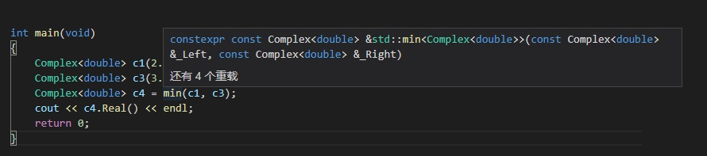

# C/C++泛型编程：模板

*了解泛型编程的思想，认识模板的概念和使用方法*

## 目录
+ [基本概念](#基本概念)
    + [泛型编程](#泛型编程)
    + [模板](#模板)
    + [模板的优缺点](#模板的优缺点)
+ [类模板](#类模板)
    + [基础的模板类](#基础的模板类)
    + [类模板的继承](#类模板的继承)
+ [函数模板](#函数模板)
+ [成员模板](#成员模板)
+ [可变模板参数](#可变模板参数)
    + [基本语法](#基本语法)
    + [可变模板参数的展开](#可变模板参数的展开)
        + [递归展开](#递归展开)
        + [逗号展开](#逗号展开)
+ [模板实例化](#模板实例化)
+ [特化](#特化)
    + [全特化](#全特化)
    + [偏特化](#偏特化)
    + [调用优先级](#调用优先级)

## 基本概念
### 泛型编程
在计算机程序设计领域，为了避免因数据类型的不同，而被迫重复编写大量相同业务逻辑的代码，人们发展出了泛型编程技术。
那么，什么是泛型呢？
所谓泛型，就是不使用具体数据类型（例如 int、double、float 等），而是使用一种通用类型来进行程序设计的方法，让我们在编程时脱离数据结构，注重算法和行为本身的设计与思考。
这里拿面向对象和泛型做对比：
泛型编程是一种**类型多态**，**参数类型高度抽象化，统一不同类型的相同行为**，是一种以相同行为为纽带的并列扩展，各个**参数类型**是横向的并列关系。
面向对象是一种**行为多态**，**函数行为高度抽象化，统一不同实现方式的行为**，是一种以父类为纽带的并列扩展，是**不同实现方式**也是横向的并列关系。

### 模板
我们现在有了一种叫做泛型编程的设计思想，那么该如何使用泛型去做编程呢？令人高兴的是，不少编程语言都有对应特性去支持我们进行泛型编程开发，在Java中是泛型(`generic`)，在c++中是模板(`template`)。
在c++中，`template` 特性，就是泛型编程的基础，其中最著名的实现例子就是大名鼎鼎的STL——Standard Template Library。
模板，一种由通用类型代替具体参数类型的语言特性，可以让我们只写一份代码去应对不同类型的调用。

### 模板的优缺点
advantages：
+ **避免一定量的重复代码**，不用因为类型不同而实现多份重复的代码——可复用性；
+ **类型安全**，避免了类型转换，在编译时就会根据调用的参数类型生成其对应版本的代码实现，

disadvantages：
+ 代码不易阅读，报错比较晦涩，
+ 没有信息隐藏信息：声明和实现在同一个文件
+ 为每种类型生成额外的代码，exe会膨胀
+ 编译时间较长，从而增加构建时间
+ 一般用于基础头文件，如果修改，涉及的地方较多，设计必须很慎重

*tips：使用泛型编程的时候，尽量将与类型无关的行为抽离出来，只保留与类型相关的部分。*

## 类模板
接下来，让我看一下如何定义和使用模板类。

### 基础的模板类
所谓类模板，实际上是建立一个通用类，这个类的部分成员、函数返回值、函数形参的类型可以不具体指定，而是用一个虚拟的类型名来暂时代替。在使用模板类来定义对象的时候，会使用传入的类型来替换掉通用类的不定类型。
```c++
template<typename Type = double>
class complex
{
public:
    complex(Type r = 0, Type i = 0) : re(r), im(i) { }
    complex& operator += (const complex& );
    Type real() const { return re; }
    Type imag() const { return im; }
private:
    Type re, im;
};
...
    complex<double> c1(2.5, 1.5);
    complex<int> c2(2, 6);
```
+ 使用 `template<typename Type>` 来告诉编译器这个类是模板类，它的不指定类型名为Type；
+ 在使用模板类时，必须像 `complex<double> c` 这样指定一个具体的类型，模板类本身不能直接被使用；
+ `template<typename Type>` 中的 `typename` 可以被 `class` 给替代，在这里他们两个之间的作用完全一样；
*tips：在c中一直使用 `class` 来充当 `typename` 的角色，直到c++中引入了 `typename`，由于向下兼容的原因， `class` 在这里的作用被保留了*
+ `template<typename Type = double>` 模板定义时，可以保留默认类型，在使用的时候像 `complex<> c3(2.5, 1.5);` 这样把参数类型空出来，当然并不建议这么去实际使用。

### 类模板的继承
接下来让我们看一下，模板类时如何继承的：
```c++
// （1）子类也是模板类
template<typename Type>
class SubComplex : public Complex<Type>
{
public:
    SubComplex(Type a, Type b) : Complex<Type>(a, b), first(a) {}
    Type First() const { return first; }
private:
    Type first;
};

// （2）子类不是模板类
class SubComplexInt : public Complex<int>
{
public:
    SubComplexInt(int a, int b) : Complex<int>(a, b), first(a) {}
    int First() const { return first; }
private:
    int first;
};
```
+ 子类是模板类时，父类的不定类型 `Type` 可以和子模板类共用，也可以在定义子模板的时候单独定义；
    ```c++
    template<typename SubType, typename Type>
    class SubComplex : public Complex<Type> {
        SubType first;
    };
    ```
+ 子类不是模板类时，需要我们在声明时，就给父模板类指定具体的参数类型。


## 函数模板
单独的函数也是可以声明为模板函数的，一个非常典型的例子就是 `min` 函数，它可以比较获取参数中最小的那一个。
```c++
template<class Type>
const Type& min(const Type& a, const Type& b)
{
    return a < b ? a : b;
}
```
它是由一个模板函数构成，可以识别不同的类型，对其进行比较；当然也可以比较自定义的类型，前提是你重载了 `<`：
```c++
template<typename Type>
class Complex
{
public:
    Complex(Type r = 0, Type i = 0) : re(r), im(i) { }
    Complex& operator+= (const Complex& );
    bool operator< (const Complex& complex) const
    {
        if(re < complex.re || (re == complex.re && im < complex.im)) {
            return true;
        }
        else {
            return false;
        }
    }
    Type Real() const { return re; }
    Type Imag() const { return im; }
private:
    Type re, im;
};

int main(void)
{
    Complex<double> c1(2.5, 1.5);
    Complex<double> c3(3.5, 1.5);
    Complex<double> c4 = min(c1, c3);
    cout << c4.Real() << endl;
 	return 0;
}
```
我们把鼠标放到min函数上，可以看见：

它会为我们生成对应类型的函数。

## 成员模板
这里的成员模板不是前面类模板中，定义了它的成员为模板，而是单指一种特别的构造函数：模板构造函数。
让我们来看一个例子：
```c++
template<typename Type>
class Complex
{
public:
    Complex(Type r = 0, Type i = 0) : re(r), im(i)
    {
        cout << "call default constructor" << endl;
    }
    Complex& operator+= (const Complex& );
    template<typename OtherType>
    Complex(const OtherType& complex) : re(complex.re), im(complex.im)
    {
        cout << "call template constructor" << endl;
    }
    Type Real() const { return re; }
    Type Imag() const { return im; }
private:
    Type re, im;
};
int main(void)
{
    Complex<double> c1(2.5, 1.5);
    Complex<double> c2(c1);
    Complex<int> c3(c1);
    cout << c2.Real() << endl;
 	return 0;
}
```
运行的结果如下：
```
call default constructor
call template constructor
2.5
```
我们可以发现，同一种类型的拷贝构造时，调用的是默认生成的拷贝构造函数，类型不同的时候，调用我们为其定义的模板构造函数。模板构造函数可以用于模板类的不同类型间的转换。

## 可变模板参数
可变模板参数，Variadic Templates，是c++11标准加入c++的语言新特性，是一个非常有趣的小特性，让我们用一个例子来认识和了解它。
```c++
#include <bitset>
void print() { }

template<typename T, typename... Types>
void print(const T& firstArg, const Types&... args)
{
    cout << firstArg << endl;
    print(args...);
}

int main(void)
{
    print(1, 2, 3.5, "string", bitset<16>(128));
 	return 0;
}
```
他的结果如下：
`1 2 3.5 string 0000000010000000`

### 基本语法
```c++
template<typename T, typename... Types>
void print(const T& firstArg, const Types&... args)
```
+ `typename...` 表示一种模板类型——可变参数模板类型，这个类型可以有多个不同或相同类型的参数；
+ `Types&...` 是对应的类型的引用写法；
+ `args...` 是在函数体内实际被使用的写法，特别的，`sizeof...(args)` 可以得到它的实际个数。

### 可变模板参数的展开
#### 递归展开
现在让我们来思考一个问题：
为什么 `print(1, 2, 3.5, "string", bitset<16>(128))` 可以告诉编译器该调用该调用我们定义的模板函数？
看下面的例子：
```c++
void print() {
    cout << "end print()" << endl;
}

template<typename T, typename... Types>
void print(const T& firstArg, const Types&... args)
{
    cout << "size of args: " << sizeof...(args) << " " << firstArg << endl;
    print(args...);
}

int main(void)
{
    print(1, 2, 3.5, "string", bitset<16>(128));
 	return 0;
}
```
结果如下：
```
size of args: 4 1
size of args: 3 2
size of args: 2 3.5
size of args: 1 string
size of args: 0 0000000010000000
end print()
```
+ `print(1, 2, 3.5, "string", bitset<16>(128))` 的参数被拆解成了 `1` 和 `args：2, 3.5, "string", bitset<16>(128)`, 执行了我们的模板函数；
+ 同时，函数结尾内递归的调用 `print(args...)`，此时参数由最开始的 `1, 2, 3.5, "string", bitset<16>(128)` 变成了 `2, 3.5, "string", bitset<16>(128)`，由此层层解套；
+ 最后 `args...` 解套完成，进入 `print()` 结束递归；
+ 递归结束函数 `print()` 可以写成 `print(T arg)`，在解套解到最后一层时结束递归。

这种有递归进行，层层解套，直到最后达到某种完成条件结束递归的方式，被称为**递归展开**。

#### 逗号展开
下面，介绍另一种展开方式——使用 `,` 展开：
```c++
template<typename Type>
void printArg(Type arg)
{
    cout << arg << endl;
}

template<typename... Types>
void expand(const Types&... args)
{
    int arr[] = {(printArg(args), 0)...};
}

int main(void)
{
    print(1, 2, 3.5, "string", bitset<16>(128));
    expand(1, 2, 3.5, "string", bitset<16>(128));
    return 0;
}
```
结果如下：
```
1
2
3.5
string
0000000010000000
```
关于 `int arr[] = {(printArg(args), 0)...}` ：
+ `(printArg(args), 0)` ，可以类比成 `d = (a = b), c`，`,` 操作符会先执行左边，然后执行右边，这里的结果就是先执行 `a = b` 的赋值操作，然后返回 `c` 赋值给 `d`；
+ `{(printArg(args), 0)...}` 是初始化列表的特性，它能将我们的代码展开成 `(printArg(1), 0), (printArg(2), 0), (printArg(3.5), 0), (printArg("string""), 0), (printArg(bitset<16>(128)), 0)`，这样我们就能将每个参数都打印出来了。

使用其他特性进行辅助，我们也达到了展开可变模板参数的目的。

*tips：我们稍微修改一下上面的代码，就可以获得一个好玩的东西*
```c++
template<class F, class... Args>
void expand(const F& func, Args&&...args)
{
    initializer_list<int>{(func(std::forward<Args>(args)),0)...};
}
......
expand([](int i){ cout << i << endl; }, 1, 2, 3);
```
*用 `lambda` 来执行匿名函数对可扩展参数的操作。*

## 模板实例化
模板类和模板函数并不是真正的类或函数，而它们需要有一个确定的版本，才能让我们在使用的时候可以直接去调用。从模板类到生成某一个对应类型的版本代码的过程，被叫做实例化。
实例化被分为显式实例化和隐式实例化，显式实例化就是我们在明确指定一个类型生成对应的类或者函数；隐式实例化就是在编译过程中由编译器成对应的类或函数。
```c++
template<typename Type>
class Complex
{
public:
    Complex(Type r = 0, Type i = 0) : re(r), im(i) { }
    Type Real() const { return re; }
    Type Imag() const { return im; }
private:
    Type re, im;
};

template class Complex<double>;

int main(void)
{
    Complex<double> c1(1.5, 2.5);   // 显式实例化
    Complex<int> c2(1, 2);          // 隐式实例化
 	return 0;
}
```
+ `template class Complex<double>;` 这样就是生成一个显式实例化模板代码，直接使用 `Complex<double> c1(1.5, 2.5);` 就可以进行调用；
+ `Complex<int> c2(1, 2);` 是在调用时由编译器生成的隐式实例化模板代码；
+ 既然有隐式实例化，为什么还要显式的声明某个版本的实例化模板呢？
    + 显式声明的实例化模板没有头文件限制，可以被放到目标文件；
    + 显式声明可以提高编译和链接时的效率；
    + 显式声明时的报错更加易读一些；
    + 当显式声明的模板实例化被放到其他文件，就可以隐藏模板类、模板函数的细节；
    + 当模板代码要做成库给别人用的时候，就需要显式实例化到目标的文件里。

## 特化
模板特化和和模板实例化并不相同，模板特化是模板参数在某种特定类型下实现一种非通用的行为，而模板实例化都是实现的模板定义时预设的通用行为。

### 全特化
顾名思义，全特化就是将模板完全特化，我们指定所有模板参数的具体类型，并为之定义非通用的行为。模板在全特化之后，就失去了 `template` 属性。
```c++
template <class Key>
struct hash { };

template<>
struct hash<char> {
    size_t operator() (char x) const { return x; }
};

template<>
struct hash<int> {
    size_t operator() (int x) const { return x; }
};

template<>
struct hash<long> {
    size_t operator() (long x) const { return x; }
};
```
+ 使用 `template<>` 去告诉编译器，我们特化了某种类型的模板；
+ 声明和定义中都使用了具体的类型去代替我们最开始定义的模板类型；
+ 我们为每个特化都定义了单独的非通用类型。

### 偏特化
偏特化，就是不完全的特化，我们指定模板的范围，为某一类模板定义非通用行为。模板在偏特化之后，仍然具有 `template` 属性。
偏特化大体上可以分为两类：
**个数的偏特化：**
```c++
// vector的源码
template<typename T, typename Alloc=......>
class vector
{
    ......
};

template<typename Alloc=.....>
class vector<bool, Alloc>
{
    ......
};
```
+ `vector` 由两个模板参数，它拥有一套不同内存分配器对模板类型的通用操作；
+ 为了给 `bool` 类型专门定义一套与通用行为不同的针对不同类别分配器的操作，这里将 `bool` 偏特化了；
+ 模板由原来的两个模板参数，变为了一个模板参数，这就是个数上的偏特化：把某个模板参数指定为明确类型，然后为这一类参数的其他模板参数行为定义出另一套通用行为。

**范围的偏特化：**
```c++
template <typename T>
class C
{
    ......
};

template <typename T>
class C<T*>
{
    ......
};

template <typename T>
class C<T&>
{
    ......
};

template <typename T>
class C<vector<T> >
{
    ......
};
```
+ 我们为模板参数划定范围，如果参数是指针就走指针的版本，是引用就走引用的版本；
+ 这里的范围主要就是将参数划分成立指针，引用和正常类型;
+ `class C<vector<T> >` 是一种特化的变种，但仍然可以用范围的偏特化进行划分，我们并没有指定 `T` 的具体类型，所以不是全特化，我们把入参是 `vector<T>` 的所以类型单独划分出来，实现针对 `vector` 的通用版本。

### 调用优先级
那么看一下我们手头上的东西：实例模板、全特化模板、偏特化模板。
编译器是怎么样把调用的参数放入不同的版本中的呢？
答案是优先级，编译器会优先去找是否有全特化版本，如果没有就会去找是否符合某一类别的偏特化版本，还是没有就会进入到模板的通用实例中。
*tips：编译器进入实例模板后，会先去寻找是否有对应的显式实例化模板，如果没有就会进入隐式实例化调用流程中。*
优先级：**全特化 > 偏特化 > 显式实例化 > 隐式实例化**
