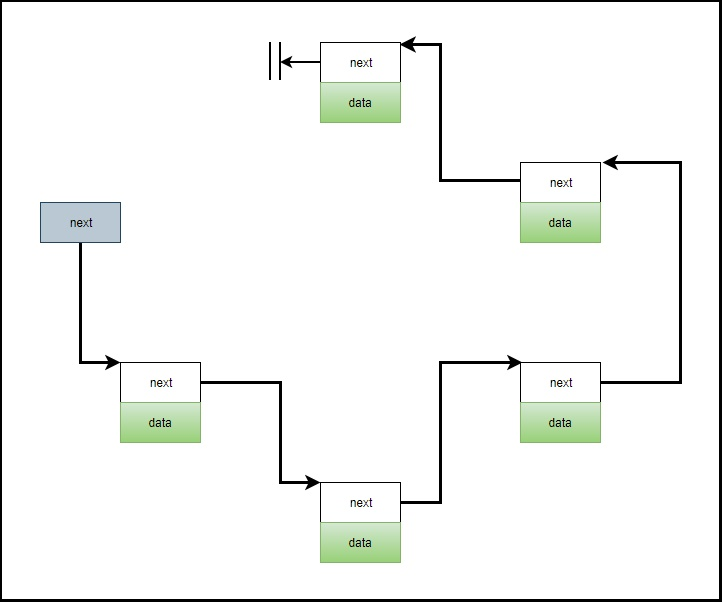

# STL容器详解

*从原理到例子，详解 C++标准库的的场景容器*

## 目录
+ [基本概念](#基本概念)
    + [STL六大部件](#STL六大部件)
    + [容器的结构与分类](#容器的结构与分类)
+ [list](#list)
+ [vector](#vector)
+ [array](#array)
+ [forward_list](#forward_list)
+ [deque](#deque)
+ [queue](#queue)
+ [stack](#stack)
+ [RBTree](#rbtree)
    + [RBTree详解](#rbtree详解)
    + [set/multiset](#set/multiset)
    + [map/multimap](#map/multimap)
+ [hashtable](#hashtable)


## 基本概念
STL是泛型编程在C++中最著名的例子，而STL的核心就是我们今天要讨论的——容器。
### STL六大部件
STL由六个组件构成：容器、分配器、算法、迭代器、适配器、仿函数。容器和算法是整个库的核心所在，其他部件都是围绕这个容器和算法做一些辅助工作。我们都知道，程序，主体是由数据结构和算法构成的。而数据结构和算法正对应着STL中的容器和算法，是我们编程的核心对象。
让我们通过一张图，来粗略的了解STL的六大部件是如何协同工作的。

+ **容器**用来存数据让我们不必去管内存，但是能存储数据就需要由分配空间，**分配器**就是用于辅助容器的内存分配手段；
+ **算法**用于操作数据，STL使用迭代器以供算法对容器内的数据进行操作；
+ 为了处理各种各样的不同容器，需要给算法和容器之间建立联系，**迭代器**就是做联系算法和容器的桥梁；
+ **仿函数**是用于代替函数的一些小辅助功能，主要是配合算法实现一些小调整；
+ **适配器**，是帮助容器、迭代器、仿函数做一些变换，以完成一些便利的功能。

我们用一个精巧的例子来看一下，STL的六大部件如何工作：
```c++
#include <iostream>
#include <functional>
#include <vector>
#include <algorithm>
using namespace std;

int main(void)
{
    int ia[6] = { 27, 210, 12, 47, 109, 83 };
    vector<int, allocator<int>> vi(ia, ia + 6);
    cout << count_if(vi.begin(), vi.end(), not1(bind2nd(less<int>(), 40)));
    return 0;
}
```
容器：`vector`、分配器：`allocator<int>`、迭代器：`vi.begin()` `vi.end()`、算法：`count_if`、仿函数：`less`、仿函数适配器：`not1` `bind2nd`
这个简单的例子向我们展示了容器和分配器对数据的存储协作，算法通过迭代器对容器内数据进行操作处理，适配器修饰仿函数以修改仿函数原本的功能。


### 容器的结构与分类
让我们高屋建瓴，从整体结构来对对容器进行分类。
下图是各个容器的内存结构，并且根据结构分成了三类：


+ 序列容器（Sequence Containers），数据按照一定的次序在内存中连续或者不连续的存储；
+ 关联容器（Associative Containers）：RBTree，数据以键值对的形式存储，把键值作为节点，在内存中存储为树（一般用RBTree或AVL-Tree来实现，各家实现细节不一样）；
+ 无序容器（Unordered Containers）：HashTable，数据以【hash值-键值对】的形式存储，它在内存中是分散的排列的。
*tips：最右图是一种场景的 `hash` 的实现*

其实把握住了每个类型容器的底层结构之后，我们更了解容器的特性，更了解在实际场景中选择我们需要的容器。当然，要去实现一种容器就是很简单的事情了。

### 各个容器之间的关系：
如下图所示：

+ 图中的容器是以缩排形式来表示“基本容器和衍生容器”的关系；
+ 基本容器和衍生容器之间不是继承关系，而是复合关系（包含关系），例如 `stack` 底层包含了一个 `deque`，但它不是继承自 `deque`。

## 容器解析说明
每个容器解析由4个部分组成：基本结构、关键代码、例子、优缺点和使用场景。
+ 基本结构展示容器的内存结构示意图；
+ 关键代码列出容器实现的底层核心代码；
+ 例子会对容器进行使用，举一个100万级的对象（string类、数字等等）作为元素的容器使用例子，来计算常见操作的耗时；
+ 优缺点和使用场景是对容器的认识进行总结，了解什么时候该用什么容器。

## list
#### 基本结构

+ `list` 是双向环装链表，由指针链接的头尾相连的结构；
+ 尾节点是一个指向头节点的不含任何数据的特殊节点，仅仅用于保持环形结构；
+ 由于 `iterator::end()` 是指向最后一个元素的后一个元素的迭代器，这里刚好指向尾节点。

#### 关键代码

```c++
/**********list使用的node的部分源码（G2.9版本）**********/
template <class T>
struct __list_node {
    typedef void* void_pointer;
    void_pointer prev;
    void_pointer next;
    T data;
};
/**********list部分源码（G2.9版本）**********/
template <class T, class Alloc = alloc>
class list {
protected:
    typedef __list_node<T> list_node;
public:
    typedef list_node* link_type;
    typedef __list_iterator<T, T&, T*> iterator;
protected:
    link_type node; // list内部含有一个node结构体
......
};
/**********list使用的迭代器的部分源码（G2.9版本）**********/
template<class T, class Ref, class Ptr>
struct __list_iterator {
    typedef T   value_type;
    typedef ptr pointer;
    typedef Ref reference;
};
```
由上述类图和例子可以知道，`list` 的底层最终还是由两个指针和一个数据对象构成的，指针分别指向前一个节点和后一个节点。
#### 例子
```c++
#include <time.h>
#include <iostream>
#include <list>
#include <string>

using namespace std;
void test_list(long value = 1000000)
{
    cout << "\ntest_list()...... \n";

    list<string> c;
    char buf[10];
    clock_t timeStart = clock();
    for (long i = 0; i < value; ++i)
    {
        try {
            snprintf(buf, 10, "%d", rand());
            c.push_back(string(buf));
        }
        catch(exception& p) {
            cout << "i=" << i << " " << p.what() << endl;
            abort();
        }
    }
    
    cout << "milli-seconds : " << (clock() - timeStart) << endl;
    cout << "list.size() = " << c.size() << endl;
    cout << "list.max_size() = " << c.max_size() << endl;
    cout << "list.front() = " << c.front() << endl;
    cout << "list.back() = " << c.back() << endl;

    string target = "23456";
    timeStart = clock();
    auto pItem = ::find(c.begin(), c.end(), target);
    cout << "::find(), milli-seconds : " << (clock() - timeStart) << endl;
    if (pItem != c.end()) {
        cout << "found, " << *pItem << endl;
    } else {
        cout << "not found!" << endl;
    }

    timeStart = clock();
    c.sort();
    cout << "c.sort(), milli-second : " << (clock() - timeStart) << endl;
}
```
结果如下
```
test_list()...... 
milli-seconds : 333
list.size() = 1000000
list.max_size() = 384307168202282325
list.front() = 41
list.back() = 12679
target (0~32767): 23456
::find(), milli-seconds : 2
found, 23456
c.sort(), milli-second : 2676
```
#### 优缺点和使用场景
##### advantages
+ 可以在任意位置插入或删除元素，操作速度很快，O(1)的时间开销；
+ 动态存储元素，不需要预先分配空间。
*tips：插入和删除操作不会导致迭代器失效*
##### disadvantages
+ 不能随机访问元素，访问某个元素必须遍历整个list；
+ 空间额外消耗大，会额外存储prev、next、data指针；
+ 由于没有提前分配空间，容易造成内存碎片，空间利用率不高。
##### 使用场景
+ 需要频繁删除或在中间插入元素，并且不太关心随机存取。

## vector
#### 基本结构

+ 在 `size` 不超过 `capacity` 的时候，`vector` 依次往后添加元素；
+ 当 `size` 大于 `capacity` 的时候，发生reallocation，重新给 `vector` 申请内存空间，并将元素移动过去；
+ 发生reallocation时的内存成长的原则：分配 `capacity * 2` 的内存空间，按照 2 倍的系数进行内存成长。
*tips：在 MinGW 上运行，实测内存是 2 倍成长，其他编译平台可能不一样*  

#### 关键代码
```c++
template <class T, class Alloc = alloc>
class vector {
public:
    typedef T           value_type;
    typedef value_type* iterator;
    typedef value_type& reference;
    typedef size_t      size_type;
protected:
    iterator start;
    iterator finish;
    iterator end_of_storage;
public:
    iterator begin() { return start; }
    iterator end() { return finish; }
    size_type size() const { return size_type(end() - begin()); }
    size_type capacity() const { return size_type(end_of_storage - begin()); }
    bool empty() const { return begin() == end(); }
    reference operator[](size_type n) { return *(begin() + n); }
    reference front() { return *begin(); }
    reference back() { return *(end() - 1); }
    ......
};
```
`vector` 底层实现的核心就是三根指针，分别指向开辟内存空间的起始 `start`， 已经使用元素的后一个位置 `end`，以及所开辟空间的结束位置 `end_of_storage`，其他一切操作都是在使用这三根指针。

#### 例子
```c++
int compareStrings(const void* a, const void*b)
{
    if (*(string*)a > *(string*)b) {
        return 1;
    } else if (*(string*)a < *(string*)b) {
        return -1;
    } else {
        return 0;
    }
}

#include <vector>
void test_vector(long value = ASIZE)
{
    cout << "\ntest_vector()...... \n";

    vector<string> c;
    char buf[10];
    clock_t timeStart = clock();
    for (long i = 0; i < value; ++i)
    {
        try {
            snprintf(buf, 10, "%d", rand());
            c.push_back(string(buf));
        }
        catch(exception& p) {
            cout << "i=" << i << " " << p.what() << endl;
            abort();
        }
    }
    
    cout << "milli-seconds : " << (clock() - timeStart) << endl;
    cout << "vector.size() = " << c.size() << endl;
    cout << "vector.front() = " << c.front() << endl;
    cout << "vector.back() = " << c.back() << endl;
    cout << "vector.data() = " << c.data() << endl;
    cout << "vector.capacity() = " << c.capacity() << endl;

    string target = "23456";
    timeStart = clock();
    auto pItem = ::find(c.begin(), c.end(), target);
    cout << "::find(), milli-seconds : " << (clock() - timeStart) << endl;
    if (pItem != c.end()) {
        cout << "found, " << *pItem << endl;
    } else {
        cout << "not found!" << endl;
    }

    timeStart = clock();
    sort(c.begin(), c.end());
    string* pSortedItem = (string*)bsearch(&target, c.data(), c.size(), sizeof(string), compareStrings);
    cout << "sort()+bsearch(), milli-seconds : " << (clock() - timeStart) << endl;
    if (pSortedItem != nullptr) {
        cout << "found, " << *pSortedItem << endl;
    } else {
        cout << "not found!" << endl;
    }
}
```
结果如下：
```
test_vector()...... 
milli-seconds : 173    
vector.size() = 1000000
vector.front() = 41
vector.back() = 12679
vector.data() = 0x4740040
vector.capacity() = 1048576
target (0~32767): 23456
::find(), milli-seconds : 1
found, 23456
sort()+bsearch(), milli-seconds : 1438
found, 23456
```
#### 优缺点和使用场景
##### advantages
+ 随机访问元素，速度很快，O(1)的时间开销；
+ 连续存储元素，空间利用率高，没有额外的内存开销；
+ 预先分配容量空间，容量内动态存储元素，超过容量后进行扩容。
*tips：插入、删除、扩容会导致迭代器失效*
##### disadvantages
+ 由于连续空间存储元素，中间和头部操作（插入和删除）会导致元素移动，O(n)的时间开销。
##### 使用场景
+ 需要高效存储，并支持随机访问；
+ 不固定长度，可以插入元素；
+ 增删操作都集中在队尾。

## array
#### 基本结构


#### 关键代码
```c++
/**********array使用的__array_traits<_Tp, _Nm>的部分源码（G4.9版本）**********/
template<typename _Tp, std::size_t _Nm>
struct __array_traits {
    typedef _Tp _Type[_Nm];

    static constexpr _Tp& _S_ref(const _Type& __T, std::size_t __n) noexcept {
        return const_cast<_Tp&>(__t[__n]);
    }
};
/**********array部分源码（G4.9版本）**********/
template <typename _Tp, std::size_t _Nm>
class array {
public:
    typedef _Tp         value_type;
    typedef value_type* pointer;
    typedef value_type& reference;
    typedef value_type* iterator;
    typedef std::size_t size_type;
protected:
    typedef _GLIBCXX_STD_C::__array_traits<_Tp, _Nm> _AT_Type;
    typename _AT_Type::_Type _M_elems; // 核心是一个数组
public:
    iterator begin() noexcept { return iterator(data()); }
    iterator end() noexcept { return iterator(data()); }
    constexpr size_type size() const noexcept { return _Nm; }
    reference operator[](size_type __n) noexcept { return _AT_Type::_S_ref(_M_elems, __n); }
    reference at(size_type __n) {
        if (__n >= _Nm) std::__throw_out_of_range_fmt(...);
        return _AT_Type::_S_ref(_M_elems, __n);
    }
    pointer data() noexcept { return std::__addressof(_AT_Type::_S_ref(_M_elems, 0)); }
    ......
};
```
`array` 的本质还是一个数组，只不过多了一些对它的迭代器操作。

#### 例子
```c++
int compareLongs(const void* a, const void*b)
{
    return (*(long*)a - *(long*)b);
}

#include <array>
void test_array(long value = ASIZE)
{
    cout << "\ntest_array()...... \n";

    array<long, ASIZE> c;
    clock_t timeStart = clock();
    for (long i = 0; i < ASIZE; ++i)
    {
        c[i] = rand();
    }
    
    cout << "milli-seconds : " << (clock() - timeStart) << endl;
    cout << "array.size() = " << c.size() << endl;
    cout << "array.front() = " << c.front() << endl;
    cout << "array.back() = " << c.back() << endl;
    cout << "array.data() = " << c.data() << endl;

    long target = "23456";
    timeStart = clock();
    qsort(c.data(), ASIZE, sizeof(long), compareLongs);
    long* pItem = (long*)bsearch(&target, c.data(), ASIZE, sizeof(long), compareLongs);
    cout << "qsort()+bsearch(), milli-seconds : " << (clock() - timeStart) << endl;
    if (pItem != NULL) {
        cout << "found, " << *pItem << endl;
    } else {
        cout << "not found!" << endl;
    }
}
```
结果如下：
```
test_array()......
milli-seconds : 75
array.size() = 1000000
array.front() = 41
array.back() = 12679
array.data() = 000000677582EA90
target (0~32767): 23456
qsort()+bsearch(), milli-seconds : 214
found, 23456
```
#### 优缺点和使用场景
##### advantages
+ 随机访问元素，速度很快，O(1)的时间开销；
+ 连续存储元素，空间利用率高，没有额外的内存开销。
*tips：把 `array` 看做可以使用迭代器的数组*
##### disadvantages
+ 不能插入和删除元素。
##### 使用场景
+ 存储对象的大小固定。

## forward_list
#### 基本结构

#### 关键代码

`forward_list` 就不po代码在这里了，详情可以看 `list` 是怎么实现的。

#### 例子
```c++
#include <forward_list>
void test_forward_list(long value = ASIZE)
{
    cout << "\ntest_forward_list()...... \n";

    forward_list<string> c;
    char buf[10];
    clock_t timeStart = clock();
    for (long i = 0; i < value; ++i)
    {
        try {
            snprintf(buf, 10, "%d", rand());
            c.push_front(string(buf));
        }
        catch(exception& p) {
            cout << "i=" << i << " " << p.what() << endl;
            abort();
        }
    }
    
    cout << "milli-seconds : " << (clock() - timeStart) << endl;
    cout << "forward_list.max_size() = " << c.max_size() << endl;
    cout << "forward_list.front() = " << c.front() << endl;
    // cout << "forward_list.back() = " << c.back() << endl;
    // cout << "forward_list.size() = " << c.size() << endl;

    string target = "23456";
    timeStart = clock();
    auto pItem = ::find(c.begin(), c.end(), target);
    cout << "::find(), milli-seconds : " << (clock() - timeStart) << endl;
    if (pItem != c.end()) {
        cout << "found, " << *pItem << endl;
    } else {
        cout << "not found!" << endl;
    }

    timeStart = clock();
    c.sort();
    cout << "c.sort(), milli-second : " << (clock() - timeStart) << endl;
}
```
结果如下：
```
test_forward_list()...... 
milli-seconds : 248
list.max_size() = 461168601842738790
list.front() = 12679
target (0~32767): 23456
::find(), milli-seconds : 2
found, 23456
c.sort(), milli-second : 1839
```
#### 优缺点和使用场景
`forward_list` 被叫做 `list` 青春版。除了从双向变为单向外，`forward_list` 的优缺点及使用场景跟 `list` 基本一样。

## deque
#### 基本结构


实际使用可以把它看成：


#### 关键代码
```c++
/**********deque使用的 __deque_iterator<T, T&, T*, BufSiz>的部分源码**********/
template<class T, class Ref, class ptr, size_t BufSiz>
struct  __deque_iterator {
    typedef T                   value_type;
    typedef Ptr                 pointer;
    typedef Ref                 reference;
    typedef size_t              size_type;
    typedef ptrdiff_t           difference_type;
    typedef T**                 map_pointer;
    typedef __deque_iterator    self;

    T* cur;
    T* first;
    T* last;
    map_pointer node;
};
/**********deque部分源码**********/
template <class T, class Alloc=alloc, size_t BufSiz=0>
class deque {
public:
    typedef _Tp value_type;
    typedef __deque_iterator<T, T&, T*, BufSiz> iterator;
protected:
    typedef pointer* map_pointer;
protected:
    iterator start;
    iterator finish;
    map_pointer map;
    size_type map_size;
public:
    iterator begin() { return start; }
    iterator end() { return finish; }
    size_type size() const { return finish - start; }
    ......
};
```
`deque` 实际上是维护一张存有几个 `buffer` 地址的表，而 `__deque_iterator<T, T&, T*, BufSiz>` 就是那个 `buffer` 的具体实现。我们可以看到，`buffer` 里面有指向这个块内存的头尾指针 `first` 和 `last`。
同时，`deque` 里有指向头和尾元素的迭代器以及记录当前 `buffer` 地址的 `map_pointer` 指针，头尾元素的迭代器用来 `buffer` 已使用的内存。
一句话总结 `deque` 就是，分段连续的存储元素。
*tips：`deque` 是如何在表现上模拟连续的？——重载迭代器的操作符*

#### 例子
```c++
#include <deque>
void test_deque(long value = ASIZE)
{
    cout << "\ntest_deque()...... \n";

    deque<string> c;
    char buf[10];
    clock_t timeStart = clock();
    for (long i = 0; i < value; ++i)
    {
        try {
            snprintf(buf, 10, "%d", rand());
            c.push_back(string(buf));
        }
        catch(exception& p) {
            cout << "i=" << i << " " << p.what() << endl;
            abort();
        }
    }
    
    cout << "milli-seconds : " << (clock() - timeStart) << endl;
    cout << "deque.size() = " << c.size() << endl;
    cout << "deque.max_size() = " << c.max_size() << endl;
    cout << "deque.front() = " << c.front() << endl;
    cout << "deque.back() = " << c.back() << endl;

    string target = "23456";
    timeStart = clock();
    auto pItem = ::find(c.begin(), c.end(), target);
    cout << "::find(), milli-seconds : " << (clock() - timeStart) << endl;
    if (pItem != c.end()) {
        cout << "found, " << *pItem << endl;
    } else {
        cout << "not found!" << endl;
    }

    timeStart = clock();
    sort(c.begin(), c.end());
    cout << "c.sort(), milli-second : " << (clock() - timeStart) << endl;
}
```
结果如下：
```
test_deque()...... 
milli-seconds : 163
deque.size() = 1000000
deque.max_size() = 576460752303423487
deque.front() = 41
deque.back() = 12679
target (0~32767): 23456
::find(), milli-seconds : 2
found, 23456
c.sort(), milli-second : 1676
```
#### 优缺点和使用场景
##### advantages
+ 随机访问元素，速度很快，O(1)的时间开销，由内存结构可知，只比 `vector` 多一次计算偏移的消耗；
+ 分段连续存储元素，空间利用率较高，额外开销较小；
+ 预先分配容量空间，容量内动态存储元素，扩容无特殊开销；
+ 对头部元素操作和对尾部操作一样快，不需要特别的开销。
*tips：`deque` 是对 `vector` 和 `list` 的折中*
##### disadvantages
+ 由于连续空间存储元素，中间操作（插入和删除）会导致元素移动，O(n)的时间开销，这一缺点就算是分段连续也无法避免；
+ 遍历比较耗时，过程中有大量的计算来链接分段的空间。
##### 使用场景
+ 跟 `vector` 的使用场景相似，当vector想向前扩展的时候，就要考虑使用 `deque`;
+ 不需要大量的遍历操作，操作的场景集中在头尾。

## queue
#### 基本结构

#### 关键代码
```c++
template <class T, class Sequence=deque<T>>
class queue {
public:
    typedef typenameSequence::value_type value_type;
    typedef typenameSequence::size_type size_type;
    typedef typenameSequence::reference reference;
    typedef typenameSequence::const_reference const_reference;
protected:
    Sequence c; // 底层容器其
public:
    bool empty() const { return c.empty(); }
    size_type size() const { return c.size(); }
    reference front() { return c.front(); }
    const_reference front() const { return c.front(); }
    reference back() { return c.back(); }
    const_referencc back() const { return c.back(); }
    void push(const value_type& x) { c.push_back(x);}
    void pop() {c.pop_front(); }
};
```
从核心代码就能看出，基本上就是把底层容器 `deque` 的功能进行限制，达到我们对 `queue` 先进先出的要求。
*tips：底层容器也可以使用 `list`*

#### 例子
```c++
#include <queue>
void test_queue(long value = ASIZE)
{
    cout << "\ntest_queue()...... \n";

    queue<string> c;
    char buf[10];
    clock_t timeStart = clock();
    for (long i = 0; i < value; ++i)
    {
        try {
            snprintf(buf, 10, "%d", rand());
            c.push(string(buf));
        }
        catch(exception& p) {
            cout << "i=" << i << " " << p.what() << endl;
            abort();
        }
    }
    
    cout << "milli-seconds : " << (clock() - timeStart) << endl;
    cout << "queue.size() = " << c.size() << endl;
    cout << "queue.front() = " << c.front() << endl;
    cout << "queue.back() = " << c.back() << endl;
    c.pop();
    cout << "queue.size() = " << c.size() << endl;
    cout << "queue.front() = " << c.front() << endl;
    cout << "queue.back() = " << c.back() << endl;
}
```
结果如下：
```
test_queue()...... 
milli-seconds : 53
queue.size() = 300000
queue.front() = 41
queue.back() = 25087
queue.size() = 299999
queue.front() = 18467
queue.back() = 25087
```
#### 优缺点和使用场景
##### advantages
+ 元素先进先出，尾部进入，头部弹出。
*tips：有一种说法是，`queue` 是对 `deque` 的适配器，对 `deque` 进行限制，让它一端进一端出*
##### disadvantages
+ 无法随机访问，只能先进先出的访问头和尾的元素；
+ 不能对其进行遍历。
##### 使用场景
+ 使用场景比较苛刻，只有在当前操作具有FIFO属性时，才适合使用 `queue`，并且容易被其他容器稍加限制就给代替了。

## stack
#### 基本结构

#### 关键代码
```c++
template <class T, class Sequence=deque<T>>
class stack {
public:
    typedef typenameSequence::value_type value_type;
    typedef typenameSequence::size_type size_type;
    typedef typenameSequence::reference reference;
    typedef typenameSequence::const_reference const_reference;
protected:
    Sequence c; // 底层容器其
public:
    bool empty() const { return c.empty(); }
    size_type size() const { return c.size(); }
    reference top() { return c.back(); }
    const_referencc top() const { return c.back(); }
    void push(const value_type& x) { c.push_back(x);}
    void pop() {c.pop_back(); }
};
```
从核心代码就能看出，基本上就是把底层容器 `deque` 的功能进行限制，达到 `stack` 先进后出的目的。
*tips：底层容器也可以使用 `list`*

#### 例子
```c++
#include <stack>
void test_stack(long value = ASIZE)
{
    cout << "\ntest_stack()...... \n";

    stack<string> c;
    char buf[10];
    clock_t timeStart = clock();
    for (long i = 0; i < value; ++i)
    {
        try {
            snprintf(buf, 10, "%d", rand());
            c.push(string(buf));
        }
        catch(exception& p) {
            cout << "i=" << i << " " << p.what() << endl;
            abort();
        }
    }
    
    cout << "milli-seconds : " << (clock() - timeStart) << endl;
    cout << "stack.size() = " << c.size() << endl;
    cout << "stack.top() = " << c.top() << endl;
    c.pop();
    cout << "stack.size() = " << c.size() << endl;
    cout << "stack.top() = " << c.top() << endl;
}
```
结果如下：
```
test_stack()...... 
milli-seconds : 58
stack.size() = 300000
stack.top() = 25087
stack.size() = 299999
stack.top() = 15249
```
#### 优缺点和使用场景
##### advantages
+ 元素先进后出，栈顶进入，栈顶弹出。
*tips：有一种说法是，`stack` 是对 `deque` 的另一种适配器，对 `deque` 进行限制，让它只能微端进出*
##### disadvantages
+ 无法随机访问，只能先进后出的访问栈顶的元素；
+ 不能对其进行遍历。
##### 使用场景
+ 使用场景比较苛刻，只有在当前操作具有FILO属性时，才适合使用 `stack`，并且容易被其他容器稍加限制就给代替了。

## RBTree
### RBTree详解
#### 基本结构

RB_Tree是一棵满足以下条件的二叉搜索树：
+ 每个节点不是红色就是黑色；
+ 根节点为黑色；
+ 如果节点为红，其子节点必须为黑；
+ 任一节点至NULL（树尾端）的任何路径，所含之黑节点数必须相同。
#### 关键代码
`__rb_tree_node<T>` 的结构：

```c++
template <class Key,
          class Value,
          class KeyOfValue,
          class Compare,
          class Alloc = alloc>
class rb_tree {
protected:
    typedef __rb_tree_node<Value> rb_tree_node;
    ...
public:
    typedef rb_tree_node* link_type;
    ...
protected:
    size_type node_count;
    link_type header;
    Compare key_compare;
    ...
};
```
#### 例子
例子就不贴了，毕竟红黑树不是c++标准委员会规定的STL标准容器，不同编译器可能有不同的私家实现。
G4.9里是 `_Rb_tree<>`，需要包含头文件“bits/stl_tree.h”。VS没找到对应的实现，不知道他有没有私家的版本。

### set/multiset
set/multiset 以 rb_tree 为底层结构，因此有“元素自动排序”特性。排序的依据是 key，而 set/multiset 元素的 value 和 key 合一：value 就是 key。

#### 关键代码
让我们看一下 set 关键代码：
```c++
template <class Key,
          class Compare = less<Key>,
          class Alloc = alloc>
class set {
public:
    typedef Key key_type;
    typedef Key value_type;
    typedef Compare key_compare;
    typedef Compare value_compare;
private:
    typedef rb_tree<key_type, value_type, identity<value_type>, key_compare, Alloc> rep_type;
    rep_type t;
public:
    typedef typename rep_type::const_iterator iterator;
...
};
```
不同编译器的实现版本不一致，上述实现版本为G2.9。

#### 例子
```c++
#include <set>
void test_multiset(long value = ASIZE)
{
    cout << "\ntest_multiset()...... \n";

    multiset<string> c;
    char buf[10];
    clock_t timeStart = clock();
    for (long i = 0; i < value; ++i)
    {
        try {
            snprintf(buf, 10, "%d", rand());
            c.insert(string(buf));
        }
        catch(exception& p) {
            cout << "i=" << i << " " << p.what() << endl;
            abort();
        }
    }
    
    cout << "milli-seconds : " << (clock() - timeStart) << endl;
    cout << "list.size() = " << c.size() << endl;
    cout << "list.max_size() = " << c.max_size() << endl;


    string target = "23456";
    timeStart = clock();
    auto pItem = ::find(c.begin(), c.end(), target);
    cout << "::find(), milli-seconds : " << (clock() - timeStart) << endl;
    if (pItem != c.end()) {
        cout << "found, " << *pItem << endl;
    } else {
        cout << "not found!" << endl;
    }

    timeStart = clock();
    pItem = c.find(target); // 比全局的::find(...)快很多
    cout << "c.find(), milli-second : " << (clock() - timeStart) << endl;
    if (pItem != c.end()) {
        cout << "found, " << *pItem << endl;
    } else {
        cout << "not found!" << endl;
    }
}
```
结果如下：
```
test_multiset()...... 
milli-seconds : 2658
multiset.size() = 1000000
multiset.max_size() = 288230376151711743
target (0~32767): 23456
::find(), milli-seconds : 58
found, 23456
c.find(), milli-second : 0
found, 23456
```

#### 优缺点和使用场景
set/multiset 以红黑树为底层容器，兼具红黑树的优点和缺点。
##### advantages
+ 容器的元素只有key没有value，或者说把value当做了key，可以直接去查找容器的里元素的值；
+ 关联式容器，内部以树实现，按照元素值进行了排序；
+ 具有查找的高效率，`find()` 的时间复杂度为O(nlogn);
+ set不允许重复元素，会在插入的时候去重，multiset允许重复容器，`find()` 只会返回结果当中的第一个。
##### disadvantages
+ 内部是以树实现的，每个节点都要存储三根指针来记录父节点和子节点，由一定的空间消耗；
+ 插入可能导致红黑树的重新调整，有一定的消耗；
+ set/multiset 的迭代器不能用来修改元素的值。
##### 使用场景
+ 主要是做查询用的，查找元素值是否存在于集合中；
+ set也可以单独拿出来构建一个有序的容器，方便我们按顺序取出内容。

### map/multimap
map/multimap 以 rb_tree 为底层结构，因此有“元素自动排序”特性。排序的依据是 key。

#### 关键代码
```c++
template <class Key,
          class T,
          class Compare = less<Key>,
          class Alloc = alloc>
class map {
public:
    typedef Key key_type;
    typedef T data_type;
    typedef T mapped_type;
    typedef pair<const Key, T> value_type;
    typedef Compare key_compare;
private:
    typedef rb_tree<key_type, value_type, select1st<value_type>, key_compare, Alloc> rep_type;
    rep_type t;
public:
    typedef typename rep_type::const_iterator iterator;
...
};
```
不同编译器的实现版本不一致，上述实现版本为G2.9。

#### 例子
```c++
#include <map>
void test_multimap(long value = ASIZE)
{
    cout << "\ntest_multiset()...... \n";

    multimap<long, string> c;
    char buf[10];
    clock_t timeStart = clock();
    for (long i = 0; i < value; ++i)
    {
        try {
            snprintf(buf, 10, "%d", rand());
            c.insert(pair<long, string>(i, buf));
        }
        catch(exception& p) {
            cout << "i=" << i << " " << p.what() << endl;
            abort();
        }
    }
    
    cout << "milli-seconds : " << (clock() - timeStart) << endl;
    cout << "multimap.size() = " << c.size() << endl;
    cout << "multimap.max_size() = " << c.max_size() << endl;


    long target = 23456;
    timeStart = clock();
    auto pItem = c.find(target);
    cout << "c.find(), milli-second : " << (clock() - timeStart) << endl;
    if (pItem != c.end()) {
        cout << "found, " << (*pItem).second << endl;
    } else {
        cout << "not found!" << endl;
    }
}
```
结果如下：
```
test_multiset()...... 
milli-seconds : 926
multimap.size() = 1000000
multimap.max_size() = 256204778801521550
target (0~32767): 23456
c.find(), milli-second : 0
found, 9489
```

#### 优缺点和使用场景
map/multimap 以红黑树为底层容器，兼具红黑树的优点和缺点。
##### advantages
+ 容器的元素是key和value组成的键值对，通过key去所以value，只能去查找容器的里元素的key；
+ 关联式容器，内部以树实现，按照key进行了排序；
+ 具有查找的高效率，`find(key)` 的时间复杂度为O(nlogn);
+ map不允许重复元素，会在插入的时候去重，multiset允许重复容器，`find()` 只会返回结果当中的第一个。
##### disadvantages
+ 内部是以树实现的，每个节点都要存储三根指针来记录父节点和子节点，由一定的空间消耗；
+ 插入可能导致红黑树的重新调整，有一定的消耗；
+ 不能高效的通过value去查找到元素，map的查找是以key为目标的。
##### 使用场景
+ 一般也是做字典用，以key去查找到对应的value值；
+ 可以将value按照key的次序进行排序。


## hashtable
### 基本结构

+ 维护了一个叫做“buckets vector”的容器，存放hash值计算后对应元素的链表；
+ 存放计算方式：根据 `hash % buckets.size()` ，讲元素放入这个余数对应的 buckets 索引得到的链表中；
+ 当元素个数大于 `buckets.size()` 后，进行“rehashing”操作，讲元素重放；
+ `hashtable` 存取元素不是很快吗，底层是链表怎么保证性能？——在存储元素的时候计算的hash值相同（hash碰撞）的概率较小，元素被存储在了不同的链表中，每个链表足够小，搜索速度仍然很快，接近常数时间；
+ “rehashing”之后的大小是多少，有什么依据？——buckets的大小一直是hash这种方法的不确定因素，因为这是一个经验值，G2.9的内部有这样一个定义：
```c++
static const unsigned long
__stl_prime_list[__stl_num_primes] = {
    53,       97,         193,          389,         769,
    1543,     3079,       6151,         12289,       24593,
    49157,    98317,      196613,       393241,      786433,
    1572869,  3145739,    6291469,      12582917,    25165843,
    50331653, 100663319,  201326611,    402653189,
    80530657, 1610612741, 3221225473ul, 4294967291ul
};
```
这里大致按照离 `2 * buckets.size()` 最近的质数来进行定义的。

### 关键代码
```c++
template <class Value>
struct __hashtable_node {
    __hashtable_node* next;
    Value val;
};

template <class Value, class Key, class HashFcn,
          class ExtractKey, class EqualKey, class Alloc=alloc>
class hashtable {
public:
    typedef HashFcn hasher;
    typedef EqualKey key_equal;
    typedef size_t size_type;
private:
    hasher hash;
    ExtractKey get_key;

    typedef __hashtable_node<Value> node;

    vector<node* , Alloc> buckets;
    size_type num_elements;
public:
    size_type bucket_count() const { return buckets.size(); }
};
```

### 例子
例子就不贴了，hashtable 不是c++标准委员会规定的STL标准容器，不同编译器可能有不同的私家实现。

### unordered containers
c++11 之前，容器有各家编译器实现的非标准的 `hash_set` 、`hash_multiset`、`hash_map`、`hash_multimap`，后来在c++11提出了统一标准的hash容器：`unordered_set` 、`unordered_multiset`、`unordered_map`、`unordered_multimap`。
```c++
template <typename T,
          typename Hash = hash<T>,
          typename EqPred = equal_to<T>,
          typename Allocator = allocator<T> >
class unordered_set;

template <typename T,
          typename Hash = hash<T>,
          typename EqPred = equal_to<T>,
          typename Allocator = allocator<T> >
class unordered_multiset;

template <typename Key, typename T,
          typename Hash = hash<T>,
          typename EqPred = equal_to<T>,
          typename Allocator = allocator<const Key, T> >
class unordered_map;

template <typename Key, typename T,
          typename Hash = hash<T>,
          typename EqPred = equal_to<T>,
          typename Allocator = allocator<const Key, T> >
class unordered_multimap;
```

#### unordered_set例子
```c++
#include <unordered_set>
void test_unordered_set(long value = ASIZE)
{
    cout << "\ntest_unordered_set()...... \n";

    unordered_set<string> c;
    char buf[10];
    clock_t timeStart = clock();
    for (long i = 0; i < value; ++i)
    {
        try {
            snprintf(buf, 10, "%d", rand());
            c.insert(string(buf));
        }
        catch(exception& p) {
            cout << "i=" << i << " " << p.what() << endl;
            abort();
        }
    }
    
    cout << "milli-seconds : " << (clock() - timeStart) << endl;
    cout << "unordered_set.size() = " << c.size() << endl;
    cout << "unordered_set.max_size() = " << c.max_size() << endl;
    cout << "unordered_set.bucket_count() = " << c.bucket_count() << endl;
    cout << "unordered_set.load_factor() = " << c.load_factor() << endl;
    cout << "unordered_set.max_load_factor() = " << c.max_load_factor() << endl;
    cout << "unordered_set.max_bucket_count() = " << c.max_bucket_count() << endl;
    for (unsigned i = 0; i < 20; ++i) {
        cout << "bucket #" << i << "has " << c.bucket_size(i) << " elements.\n";
    }
    
    string target = "23456";
    timeStart = clock();
    auto pItem = ::find(c.begin(), c.end(), target);
    cout << "::find(), milli-seconds : " << (clock() - timeStart) << endl;
    if (pItem != c.end()) {
        cout << "found, " << *pItem << endl;
    } else {
        cout << "not found!" << endl;
    }

    timeStart = clock();
    pItem = c.find(target);
    cout << "c.find(), milli-second : " << (clock() - timeStart) << endl;
    if (pItem != c.end()) {
        cout << "found, " << *pItem << endl;
    } else {
        cout << "not found!" << endl;
    }
}
```
结果如下：
```
test_unordered_set()...... 
milli-seconds : 368
unordered_set.size() = 32768
unordered_set.max_size() = 384307168202282325        
unordered_set.bucket_count() = 53201
unordered_set.load_factor() = 0.615928
unordered_set.max_load_factor() = 1
unordered_set.max_bucket_count() = 384307168202282325
bucket #0has 2 elements.
bucket #1has 0 elements.
bucket #2has 1 elements.
bucket #3has 1 elements.
bucket #4has 0 elements.
bucket #5has 0 elements.
bucket #6has 1 elements.
bucket #7has 0 elements. 
bucket #8has 1 elements. 
bucket #9has 1 elements. 
bucket #10has 0 elements.
bucket #11has 0 elements.
bucket #12has 0 elements.
bucket #13has 2 elements.
bucket #14has 0 elements.
bucket #15has 2 elements.
bucket #16has 0 elements.
bucket #17has 0 elements.
bucket #18has 0 elements.
bucket #19has 0 elements.
target (0~32767): 23456
::find(), milli-seconds : 2
found, 23456
c.find(), milli-second : 0
found, 23456
```


#### unordered_map例子
```c++
#include <unordered_map>
void test_unordered_map(long value = ASIZE)
{
    cout << "\ntest_unordered_map()...... \n";

    unordered_map<long, string> c;
    char buf[10];
    clock_t timeStart = clock();
    for (long i = 0; i < value; ++i)
    {
        try {
            snprintf(buf, 10, "%d", rand());
            c.insert(pair<long, string>(i, buf));
        }
        catch(exception& p) {
            cout << "i=" << i << " " << p.what() << endl;
            abort();
        }
    }
    
    cout << "milli-seconds : " << (clock() - timeStart) << endl;
    cout << "unordered_map.size() = " << c.size() << endl;
    cout << "unordered_map.max_size() = " << c.max_size() << endl;
    cout << "unordered_map.bucket_count() = " << c.bucket_count() << endl;
    cout << "unordered_map.load_factor() = " << c.load_factor() << endl;
    cout << "unordered_map.max_load_factor() = " << c.max_load_factor() << endl;
    cout << "unordered_map.max_bucket_count() = " << c.max_bucket_count() << endl;
    for (unsigned i = 0; i < 20; ++i) {
        cout << "bucket #" << i << "has " << c.bucket_size(i) << " elements.\n";
    }
    
    long target = 23456;
    timeStart = clock();
    auto pItem = c.find(target);
    cout << "c.find(), milli-second : " << (clock() - timeStart) << endl;
    if (pItem != c.end()) {
        cout << "found, " << (*pItem).second << endl;
    } else {
        cout << "not found!" << endl;
    }
}
```
结果如下：
```
test_unordered_map()...... 
milli-seconds : 779
unordered_map.size() = 1000000
unordered_map.max_size() = 384307168202282325        
unordered_map.bucket_count() = 1832561
unordered_map.load_factor() = 0.545684
unordered_map.max_load_factor() = 1
unordered_map.max_bucket_count() = 384307168202282325
bucket #0has 1 elements.
bucket #1has 1 elements.
bucket #2has 1 elements.
bucket #3has 1 elements.
bucket #4has 1 elements.
bucket #5has 1 elements.
bucket #6has 1 elements.
bucket #7has 1 elements.
bucket #8has 1 elements.
bucket #9has 1 elements.
bucket #10has 1 elements.
bucket #11has 1 elements.
bucket #12has 1 elements.
bucket #13has 1 elements.
bucket #14has 1 elements.
bucket #15has 1 elements.
bucket #16has 1 elements.
bucket #17has 1 elements.
bucket #18has 1 elements.
bucket #19has 1 elements.
target (0~32767): 23456
c.find(), milli-second : 0
found, 9489
```

#### 优缺点和使用场景
unordered_set/unordered_map的优缺点主要集中在了hash实现上。
##### advantages
+ 容器的元素计算hash后，存储hash值和元素的映射关系；
+ 无序式容器，内部以哈希表实现，无序存储；
+ 具有时间复杂度为O(1)的元素查找和访问效率;
+ unordered_set就是按值去查找，unordered_map就是按照key去查找。
##### disadvantages
+ 内部是以哈希表实现的，需要额外存储hash值和元素值；
+ 无序容器，舍弃掉了 set/map 的排序能力；
+ 当存储赋值的自定义结构时，需要为该类型自定义hash函数，没有自带处理复杂类型的hash函数。
##### 使用场景
+ 对插入、删除、和查找的效率有极高要求的场景；
+ 不需要对元素排序的场景。
