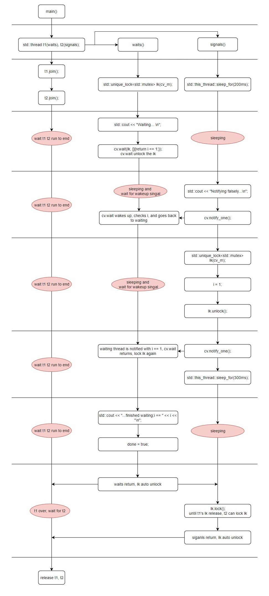

# C++多线程编程

*本文主要围绕 C++11 及以后的版本，讨论新支持的多线程和同步机制*

## 目录
+ [CPU中的进程和线程](#CPU中的进程和线程)
    + [CPU工作原理](#CPU工作原理)
    + [进程和线程](#进程和线程)
+ [多线程](#多线程)
    + [std::thread](#std::thread)
    + [std::jthread](#std::jthread)
+ [同步机制](#同步机制)
    + [互斥量与锁](#互斥量与锁)
        + [std::mutex](#std::mutex)
        + [Generic mutex management](#generic-mutex-management)
    + [条件变量](#条件变量)
    + [信号量](#信号量)
    + [线程屏障](#线程屏障)
        + [std::latch](#std::latch)
        + [std::barrier](#std::barrier)

## CPU中的进程和线程
*简单介绍 CPU、核心、进程、线程四者的关系*
### CPU工作原理
先上个CPU工作原理图，结合图示来讲讲CPU是怎么进行工作的：


+ 代码段被翻译为一条条指令，被CPU的控制单元接受用来执行；
+ 数据段被存储单元读取，用以提供数据给控制单元或运算单元进行具体的操作；
+ 指令执行完成后的结果被写回存储单元，然后由存储单元写回数据段。

### CPU架构
认识一下常见的几种CPU架构：
#### 单核CPU

+ 单核CPU只有一个核心CORE；
+ CPU内部有多个cache，就是俗称的多级缓存（L1、L2、L3三级缓存），越靠近CORE的缓存空间越小，但读写速度越快；
+ MMU，Memory Management Unit内存管理单元，是CPU访问内存、读写数据的管理单元。

#### 多核CPU

+ 多核CPU，顾名思义是有两个及以上核心数量的CPU；
+ 对于CPU本身而言，它拥有一个MMU和一个L3 cache，被多个核心共享，不同核心通过L3 cache共享和同步数据；
+ 对于核心而言，它独立拥有一个L1 cache和一个L2 cache，用来进行自身的指令执行和数据读写。

#### 多CPU

+ 多CPU中关于核心的内容，基本和单CPU一致，不过多赘述；
+ 因为有多个CPU，所有每个CPU有独立的MMU和L3 cache，因此CPU间通信主要依靠内存，他们本身不能直接通信。

### 进程和线程
*老生常谈的解释：进程是资源分配的基本单位，线程是CPU调度的基本单位。这个定义相信计算机相关从业人员都听过，但是过于抽象。本节将会结合笔者对CPU的理解对进程和线程进行分析和解释。*
#### 进程
##### 动态
程序在执行时，会在内存中分配空间来管理代码（指令）和资源（堆栈、读取的文件等），而这些在内存中临时的、动态生成的资源集合被称为进程。进程是程序的执行过程，动态产生和消亡。
##### 并发
不同进程在CPU中是并发执行，所有进程被CPU轮询调度。
*被 CPU 轮流切换执行叫并发；被 CPU 同时执行叫并行。*
##### 独立
进程是某个程序的执行过程，那么相对于其他进程而言，这个进程是独立的、不受其他进程影响的。
*经典说法：进程崩溃不会影响到其他进程。这就是进程独立的体现。*

#### CPU中的进程
具体看下CPU是如何并发的执行不同进程的。


+ 执行某个进程的时间段被称为CPU时间片；
+ CPU时间片不断切换，表示CPU在不断的轮询调度不同的进程；
+ 图中的进程A、B、C的不断切换凸显了进程的并发和独立。

#### 线程
*世界上本没有线程，但嫌弃CPU切换进程太慢的人多了，也就有了线程。*
##### 线程的出现
原本CPU调度的最基本单位是进程，但是因为要并发不同进程，每次都要重新从内存中读取进程的上下文，这个操作比较耗时。于是就有了线程的出现，帮助我们缩短切换的时间。


+ 这里把进程并发转换成了线程并发，就CPU的执行而言，时间不增不减；
+ 变化点：
    + 进程切换会有CPU访问内存保存和卸载当前进程的上下文，装载下一个进程的上下文；
    + 线程切换由CPU访问内部cache切换线程的上下文。
+ CPU内部的读写操作总是比CPU去读写内存要快上很多，这一部分时间就被节约了下来。

##### 线程的并行
CPU由单核心阶段性的进化到了多核心，那么CPU不同的核心就可以并行的执行不同的线程，从而减少CPU执行的时间。

+ 每个核心可以独立执行一个线程，如果分配得当的话，不会出现线程竞争的情况；
+ 变化点：
    + 多个线程可以同时被CPU执行，不再出现线程等待的空白耗时；
    + 线程不会出现切换上下的额外耗时。

### 特别的CPU架构
这里扩展一下其他类型的CPU架构。
需要说明的是，笔者是基于一个CPU只能在一个CPU时间片内执行一个进程，一个核心只能执行一个线程的朴素观念对前文CPU中的进程和线程进行理解的。但是随着技术发展，已经有了以下介绍的更新更高级的CPU架构，但对于我们理解进程和线程的工作是没有太大影响的。
##### 双核4线程

+ 每个核心可以并行的执行两个线程；
+ 据说每个核心拥有自己单独的MMU，那么理论上来说每个核心就可以执行单独的进程，进程开始并行执行；
+ 这样看上去更像多CPU架构了，每个核心相当于单独的CPU。

## 多线程
终于进入到了正题，让我们来认识一下C++标准库定义的几个线程类。
### std::thread
#### 基础用法
老规矩，先上个例子看看这个类怎么用：
```c++
#include <iostream>
#include <chrono>
#include <thread>

std::thread::id main_thread_id;

void hello()  
{
    std::cout << "Hello current World\n";
    if (main_thread_id == std::this_thread::get_id())
        std::cout << "This is the main thread.\n";
    else
        std::cout << "This is not the main thread.\n";
    std::cout << "current thread id = " << std::this_thread::get_id() << std::endl;
}

void pause_thread(int n) {
    std::this_thread::sleep_for(std::chrono::seconds(n));
    std::cout << "pause of " << n << " seconds ended\n";
}

int main()
{
    main_thread_id = std::this_thread::get_id();
    std::thread t(hello);
    t.join();
    // 主线程等待上面线程执行完成
    std::this_thread::sleep_for(std::chrono::seconds(2));
    std::cout << "hardware_concurrency = " << t.hardware_concurrency() << std::endl; //可以并发执行多少个(不准确)
    std::cout << "native_handle = " << t.native_handle() << std::endl; //可以并发执行多少个(不准确)

    {
        std::cout << "start t1 thread\n";
        std::thread t1(pause_thread, 5);
        std::cout << "start t2 thread\n";
        std::thread t2(pause_thread, 1);
        t1.join();
        t2.join();
        std::cout << "end this scope\n";
    }
    std::cout << "end thread t1,t2\n";
    {
        std::cout << "start t3 thread\n";
        std::thread t3(pause_thread, 1);
        std::cout << "start t4 thread\n";
        std::thread t4(pause_thread, 1);
        t3.detach();
        t4.detach();
    }
    std::cout << "end thread t3,t4\n";
    // 主线程等待上面线程执行完成
    std::this_thread::sleep_for(std::chrono::seconds(2));
    return 0;
}
```
结果如下：
```
Hello current World
This is not the main thread.
current thread id = 2
hardware_concurrency = 8
native_handle = 2
start t1 thread
start t2 thread
pause of 1 seconds ended
pause of 5 seconds ended
end this scope
end thread t1,t2
start t3 thread
start t4 thread
end thread t3,t4
pause of 1 seconds ended
pause of 1 seconds ended
```
`std::stread(func, ...)`
+ 是创建一个线程的基本格式，我们传入可调用对象和参数来定义这个线程该执行的操作。示范例子中就分别使用了带参数和不带参数调用两种定义方式。

`std::this_thread::get_id()`
+ 可以让我们得到当前执行指令的线程的线程号。

`t.hardware_concurrency()`
+ 返回支持的并发线程数。

`t.native_handle()`
+ 返回底层实现定义的线程句柄，在例子中返回的是线程号。

`t1.join()`
+ 该函数会等待 t1 线程执行结束才返回，通俗的说就是调用`join()`函数的线程被阻塞了，直到 t1 线程直到完成执行。
    让我们来看一下例子，比较值得注意的有两点：
    + 先设置`t1.join()`，后设置`t2.join()`，但是 t2 线程并没有被阻塞，而是先于t1完成；
    + `std::cout << "end this scope"\n`，被阻塞着，直到 t1 和 t2 线程执行完成才被调用打印。
    `join()`函数只能阻塞当前调用函数的线程。

`t3.detach()`
+ 调用`detach()`后，表示 t3 线程与句柄所在线程独立开，单独执行。
    为什么要有`detach()`？
    + 如果不调用`detach()`，t3 线程句柄会在离开这个作用域时立即销毁掉，同时杀掉这个线程，不管t3 线程是否执行结束；
    + 在不调用`detach()`时，销毁 t3 线程会导致`terminate called without an active exception`告警。
    但是`detach()`必须小心使用，如果程序结束时这个被分离出来的线程还没有执行完成，是一个非常糟糕的结果。

`thread.join()`和`thread.detach()`是处理线程执行的两种不同策略:
+ 如果我们需要线程先执行完才能做某些操作就使用`thread.join()`，去等待对应的线程执行结束拿到结果。
+ 如果我们后续的操作不依赖线程执行的结果，那完全可以使用`thread.detach()`将线程分离出来执行，不去阻塞其他线程。

#### 等待函数
等待函数简单写一下接口描述，就不po代码了，可以跑代码里的`test_thread_function::test_thread_function()`看看演示实例。
`std::this_thread::yield()`
+ 重新调度线程的执行顺序，运行其他线程运行。
用人话来说就是，CPU核心数小于线程数时，必然后线程会等待，我们使用`yield()`来重新分配CPU的执行顺序，让其他等待的线程先执行。如果CPU核心数大于线程，那么这个函数没有任何效果，各个线程依然各自美丽。
*Tips：这个函数依赖各个编译器的实现，以及使用中的 OS调度机制和系统状态。例如，先进先出实时调度器（ Linux的 SCHED_FIFO）将挂起当前线程并将它放到同优先级线程的等待队列的队尾。*

`std::this_thread::sleep_for(2000ms)`
+ 当前线程睡眠设置的时长。

`std::this_thread::sleep_until(now() + 2000ms)`
+ 当前线程睡眠，直到设置的时间点被唤醒。

### std::jthread
```c++
// jthread c++20的新特性 需要编译器支持
void sleep(const int& seconds)
{
    std::this_thread::sleep_for(std::chrono::seconds(seconds));
}

int main()
{
    std::jthread jt{ [](std::stop_token st) {
        while(!st.stop_requested()) {
            std::cout << "doing work\n";
            sleep(1);
        }
    }};
    sleep(5);
    jt.request_stop();
    return 0;
}
```
输出如下：
```
doing work
doing work
doing work
doing work
doing work
```
C++20推了一个新的线程类`std::jthread`，拥有`std::thread`的基本功能，并且还额外拥有自动调用`join()`的能力。
其实具体实现很简单：
```c++
jthread::~jthread()
{
    if (joinable()) {
        request_stop();
        join();
    }
}
```
我们从例子中可以看到，多了两个新的函数`jt.request_stop()`、`st.stop_requested()`。
`jt.request_stop()`
+ 我们可以通过线程对象给线程发消息，将线程对象中`std::stop_source`类型的私有成员状态设置为请求停止。

`st.stop_requested()`
+ 查询线程对象中`std::stop_source`类型的私有成员状态释放为请求停止状态，如果是则返回`true`.

将两个函数组合起来使用，就可以让外部控制线程的一些逻辑走向了。

## 同步机制
我们可以并行执行我们的线程，但资源始终只有一份，那么如果共享资源就是多线程的重点内容了。

### 互斥量与锁
#### std::mutex
C++11新增了互斥量`std::mutex`，让不同的线程可以竞争的去共享资源。
```c++
#include <iostream>
#include <map>
#include <string>
#include <chrono>
#include <thread>
#include <mutex>
 
std::map<std::string, std::string> g_pages;
std::mutex g_pages_mutex;
 
void save_page(const std::string &url)
{
    // simulate a long page fetch
    std::this_thread::sleep_for(std::chrono::seconds(2));
    std::string result = "fake content";
 
    g_pages_mutex.lock();
    g_pages[url] = result;
    g_pages_mutex.unlock();
}
 
int main() 
{
    std::thread t1(save_page, "http://foo");
    std::thread t2(save_page, "http://bar");
    t1.join();
    t2.join();
 
    // safe to access g_pages without lock now, as the threads are joined
    for (const auto &pair : g_pages) {
        std::cout << pair.first << " => " << pair.second << '\n';
    }
    return 0;
}
```
这个例子展示了`std::mutex`对象如何保护被两个线程共享的`std::map`。
但是，我们需要知道的是：
+ **当我们锁定`std::mutex`的时候，仅仅是`std::mutex`这个对象被锁定，而不是资源本身；**
这个时候我们的其他线程仍然可以访问修改这个资源。
+ **当某个线程锁定了`std::mutex`对象，其他线程如果再次调用锁定函数时就会被阻塞在这里，直到`std::mutex`对象被其他线程解锁；**
我们在写代码的时候，会约定`g_pages_mutex`表示着`g_pages`的使用状态，每次访问`g_pages`都会尝试锁定`g_pages_mutex`，锁定成功就进行访问，不成功就阻塞等待，直到锁定成功。

`g_pages_mutex.lock()`
+ 尝试锁定`g_pages_mutex`对象，如果成功就返回，否则就阻塞直到成功。

`g_pages_mutex.unlock()`
+ 解锁处于锁定状态的`g_pages_mutex`对象。

#### Generic mutex management
除了`std::mutex`自带的锁定函数，我们还有一些封装成不同功能的锁定函数，这里为大家一一介绍讲解。

##### lock_guard(C++11)
我们直接把上面`std::mutex`的例子改一下：
```c++
...
void save_page(const std::string &url)
{
    ...
 
    // g_pages_mutex.lock();
    std::lock_guard<std::mutex> guard(g_pages_mutex);
    g_pages[url] = result;
    // g_pages_mutex.unlock();
}
....
```
`std::lock_guard<std::mutex> guard(g_pages_mutex)`
+ 以`std::mutex`对象为参数创建一个`lock_guard`对象，这个对象构造时自动加锁，析构时自动解锁。
以对象的方式管理锁定和解锁互斥量`std::mutex`，实现方式就是非常常见的构造函数里调用`mutex.lock()`，析构函数里调用`mutex.unlock()`。

##### unique_lock(C++11)
`unique_lock`
+ 可以关联`std::mutex`对象并锁定（此功能和`lock_guard`一样），也可以关联`std::mutex`对象但不锁定（可用于避免死锁问题）。

如果当我们要同时锁定两个及以上资源的时候，往往有可能出现不同线程持有不同资源并等待其他资源的尴尬场景，这个时候可以转头使用`unique_lock`来避免这样的问题，例子如下：
```c++
#include <thread>
#include <mutex>
struct Box {
    explicit Box(int num) : num_things{num} {}

    int num_things;
    std::mutex m;
};

void transfer(Box &from, Box &to, int num)
{
    // don't actually take the locks yet
    std::unique_lock<std::mutex> lock1(from.m, std::defer_lock);
    std::unique_lock<std::mutex> lock2(to.m, std::defer_lock);

    // lock both unique_locks without deadlock
    std::lock(lock1, lock2);

    from.num_things -= num;
    to.num_things += num;

    // 'from.m' and 'to.m' mutexes unlocked in 'unique_lock' dtors
}

int main()
{
    Box acc1(100);
    Box acc2(50);

    std::thread t1(transfer, std::ref(acc1), std::ref(acc2), 10);
    std::thread t2(transfer, std::ref(acc2), std::ref(acc1), 5);

    t1.join();
    t2.join();

    return 0;
}
```
+ 使用`std::unique_lock<std::mutex> lock1(from.m, std::defer_lock)`关联`std::mutex`对象而不锁定；
+ `std::lock(lock1, lock2)`线程一次性锁定所有需要的资源，避免多次锁定不同资源而造成的死锁。

##### scoped_lock(C++17)
`scoped_lock`
+ 自动锁定版的`unique_lock`对象，可以直接使用多个`std::mutex`对象作为参数，构造时对所有互斥量进行锁定，析构时自动解锁。

这个没什么好说的，直接上例子：
```c++
#include <mutex>
#include <thread>
#include <iostream>
#include <vector>
#include <functional>
#include <chrono>
#include <string>

struct Employee {
    Employee(std::string id) : id(id) {}
    std::string id;
    std::vector<std::string> lunch_partners;
    std::mutex m;
    std::string output() const
    {
        std::string ret = "Employee " + id + " has lunch partners: ";
        for( const auto& partner : lunch_partners )
            ret += partner + " ";
        return ret;
    }
};
 
void send_mail(Employee &, Employee &)
{
    // 模拟耗时的发信操作
    std::this_thread::sleep_for(std::chrono::seconds(1));
}
 
void assign_lunch_partner(Employee &e1, Employee &e2)
{
    static std::mutex io_mutex; // 打印互斥
    {
        std::lock_guard<std::mutex> lk(io_mutex);
        std::cout << e1.id << " and " << e2.id << " are waiting for locks" << std::endl;
    }
 
    {
        // 用 std::scoped_lock 取得二个锁，而无需担心
        // 其他对 assign_lunch_partner 的调用死锁我们
        // 而且它亦提供便利的 RAII 风格机制
        std::scoped_lock lock(e1.m, e2.m);
 
        {
            std::lock_guard<std::mutex> lk(io_mutex);
            std::cout << e1.id << " and " << e2.id << " got locks" << std::endl;
        }
        // 互斥操作 使用scoped同时获取并锁定多个资源进行操作 资源之间不死锁
        e1.lunch_partners.push_back(e2.id);
        e2.lunch_partners.push_back(e1.id);
    }
    
    // 无竞争耗时操作
    send_mail(e1, e2);
    send_mail(e2, e1);
}
 
int main()
{
    Employee alice("alice"), bob("bob"), christina("christina"), dave("dave");
 
    // 在并行线程中指派，因为就午餐指派发邮件消耗很长时间
    std::vector<std::thread> threads;
    threads.emplace_back(assign_lunch_partner, std::ref(alice), std::ref(bob));
    threads.emplace_back(assign_lunch_partner, std::ref(christina), std::ref(bob));
    threads.emplace_back(assign_lunch_partner, std::ref(christina), std::ref(alice));
    threads.emplace_back(assign_lunch_partner, std::ref(dave), std::ref(bob));
 
    for (auto &thread : threads) thread.join();
    std::cout << alice.output() << '\n'  << bob.output() << '\n'
              << christina.output() << '\n' << dave.output() << '\n';
    return 0;
}
```

##### shared_lock(C++14)和shared_mutex(C++17)
`shared_lock`和`shared_mutex`是互相配合使用的，可令人迷惑的是`shared_lock`出自C++14的标准，`shared_mutex`出自C++17的标准。破案了，C++标准委员会中有未来战士（笑）。
`shared_mutex`
+ 创建共享互斥量，拥有两个锁定等级：
    + 共享锁定：多个线程都能锁定`shared_mutex`而不阻塞；
    + 独占锁定：只有一个线程可以占有`shared_mutex`。

说白了，这就是个读写互斥量，能被多个线程共享的锁定，此时只读；被一个线程独占锁定，只有这个线程可以读写。没有独占锁定时，多个线程可以进行共享锁定；如果某个线程申请独占锁定，那么等待所有共享锁定解除后，线程锁定这个共享互斥量；在等待申请独占锁定时，线程申请共享锁定会被阻塞，直到独占锁定解锁。
例子如下：
```c++
#include <iostream>
#include <mutex>  // 对于 std::unique_lock
#include <shared_mutex>
#include <thread>

class ThreadSafeCounter {
public:
ThreadSafeCounter() = default;

// Multiple threads/readers can read the counter's value at the same time.
unsigned int get() const {
    std::shared_lock lock(mutex_);
    return value_;
}

// Only one thread/writer can increment/write the counter's value.
void increment() {
    std::unique_lock<std::shared_mutex> lock(mutex_);
    value_++;
}

// Only one thread/writer can reset/write the counter's value.
void reset() {
    std::unique_lock lock(mutex_);
    value_ = 0;
}

private:
    mutable std::shared_mutex mutex_;
    unsigned int value_ = 0;
};

int main() {
     ThreadSafeCounter counter;

    auto increment_and_print = [&counter]() {
        for (int i = 0; i < 3; i++) {
            // std::cout << std::this_thread::get_id() << ' ' << counter.increment() << '\n';
            counter.increment();
            std::cout << std::this_thread::get_id() << ' ' << counter.get() << '\n';

            // Note: Writing to std::cout actually needs to be synchronized as well
            // by another std::mutex. This has been omitted to keep the example small.
        }
    };

    std::thread thread1(increment_and_print);
    std::thread thread2(increment_and_print);

    thread1.join();
    thread2.join();
    return 0;
}
```

##### lock tag constants
在`unique_lock`一节中，我们有使用这样的写法来防止死锁：
```c++
...
void transfer(Box &from, Box &to, int num)
{
    // don't actually take the locks yet
    std::unique_lock<std::mutex> lock1(from.m, std::defer_lock);
    std::unique_lock<std::mutex> lock2(to.m, std::defer_lock);

    // lock both unique_locks without deadlock
    std::lock(lock1, lock2);
    ...
}
...
```
我们在创建`unique_lock`对象时，用到了一个常量`std::defer_lock`，这是一种锁的策略标签，为我们指定这次的锁定策略是什么。
`std::defer_lock`
+ `unique_lock`构造时申明了锁定策略为，与`std::mutex`关联而不锁定，需要有`std::mutex`**没有被锁定**作为前置条件。
它的作用很简单，从关联后开始，我们把`std::mutex`的装到`unique_lock`里，此后可以按照`unique_lock`的生命周期进行锁定和解锁管理。

`std::adopt_lock`
+ `unique_lock`或`lock_guard`构造时指明锁定策略为，与`std::mutex`关联而不锁定，需要有`std::mutex`**已经被锁定**作为前置条件。
它的作用也很简单，为直接锁定的`std::mutex`关联到某种锁上，方便后面自动析构解锁。
我们可以把上面的例子使用这个策略来做修改，仍然可以防止死锁：
```c++
...
void transfer(Box &from, Box &to, int num)
{
    // 锁定两个互斥而不死锁
    std::lock(from.m, to.m);
    // 保证二个已锁定互斥在作用域结尾解锁
    std::lock_guard<std::mutex> lock1(from.m, std::adopt_lock);
    std::lock_guard<std::mutex> lock2(to.m, std::adopt_lock);
    ...
}
...
```

`std::try_to_lock`
+ `unique_lock`构造时申明了锁定策略为，尝试锁定`std::mutex`，如果失败不会阻塞。
其实就跟`std::mutex.try_lock()`是一样的功能，这不过这里可以使用锁的析构自动解锁去管理罢了。
```c++
...
void transfer(Box &from, Box &to, int num)
{
    ...
    std::unique_lock<std::mutex> lock1(from.m, std::adopt_lock);
    if (lock1.owns_lock()) {
        ...
    } else {
        ...
    }
    ...
}
...
```

### 条件变量
条件变量是配合互斥量`std::mutex`使用，可以完成一些线程的交互。
看一下例子：
```c++
#include <iostream>
#include <condition_variable>
#include <thread>
#include <chrono>
using namespace std::chrono_literals;
 
std::condition_variable cv;
std::mutex cv_m;
int i = 0;
bool done = false;

void waits()
{
    std::unique_lock<std::mutex> lk(cv_m);
    std::cout << "Waiting... \n";
    cv.wait(lk, []{return i == 1;});
    std::cout << "...finished waiting; i == " << i << '\n';
    done = true;
}

void signals()
{
    std::this_thread::sleep_for(200ms);
    std::cout << "Notifying falsely...\n";
    cv.notify_one(); // waiting thread is notified with i == 0.
                     // cv.wait wakes up, checks i, and goes back to waiting

    std::unique_lock<std::mutex> lk(cv_m);
    i = 1;
    while (!done) 
    {
        std::cout << "Notifying true change...\n";
        lk.unlock();
        cv.notify_one(); // waiting thread is notified with i == 1, cv.wait returns
        std::this_thread::sleep_for(300ms);
        lk.lock();
    }
}

int mian()
{
    std::thread t1(waits), t2(signals);
    t1.join(); 
    t2.join();
    return 0;
}
```
结果如下：
```
Waiting... 
Notifying falsely...       
Notifying true change...   
...finished waiting; i == 1
```
我们来分析它的整个流程，并画出流程图：


`std::condition_variable`
+ 条件变量类型的对象是配合互斥量`std::mutex`一起使用的。

`cv.wait(lk, []{return i == 1;})`
+ `wait(lockObj, funcObj)`，参数为锁定对象和可调用函数对象，对lockObj进行解锁，然后执行一次funcObj获取返回值：如果为真，则锁定lockObj然后`wait(...)`返回；如果不为真，则阻塞线程。

`cv.notify_one()`
+ `notify_one()`会唤醒正在`wait()`的**同一个条件变量**上的**某个线程**，被唤醒的线程触发一次funcObj获取返回值：如果为真，则锁定lockObj然后`wait(...)`返回；如果不为真，则阻塞线程。
这个函数就是通知`wait()`中的线程重新检查是否结束等待状态。

`cv.notify_all()`
+ `notify_all()`会唤醒正在`wait()`的**同一个条件变量**上的**所有线程**，被唤醒的线程触发一次funcObj获取返回值：如果为真，则锁定lockObj然后`wait(...)`返回；如果不为真，则阻塞线程。
这个函数跟`cv.notify_one()`的功能基本一致，唯一的区别就是通知所有等待中的线程。

### 信号量
C++20的标准才加入信号量，之前都是我们自己实现信号量类，自定义PV操作来做线程同步。新加入的信号量比较简单，直接看一下例子吧

### 线程屏障
#### std::latch
#### std::barrier
